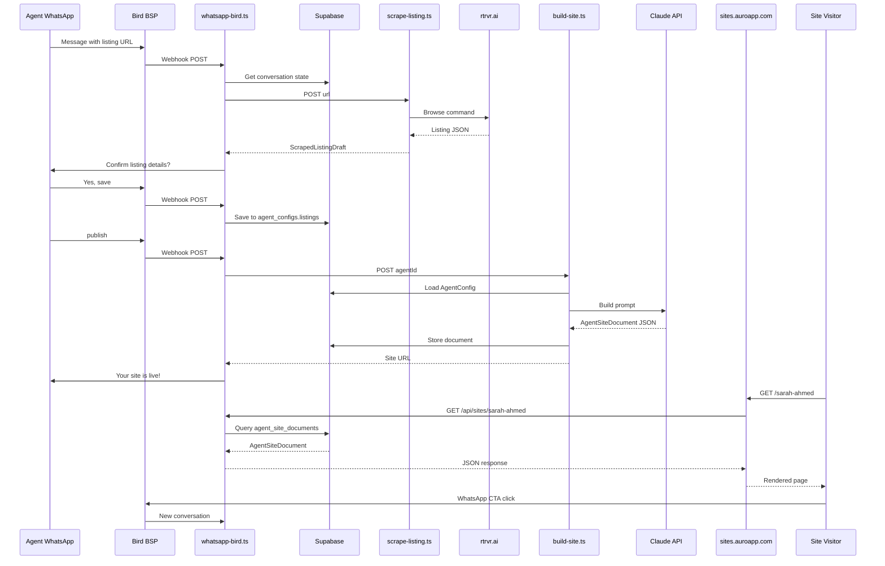
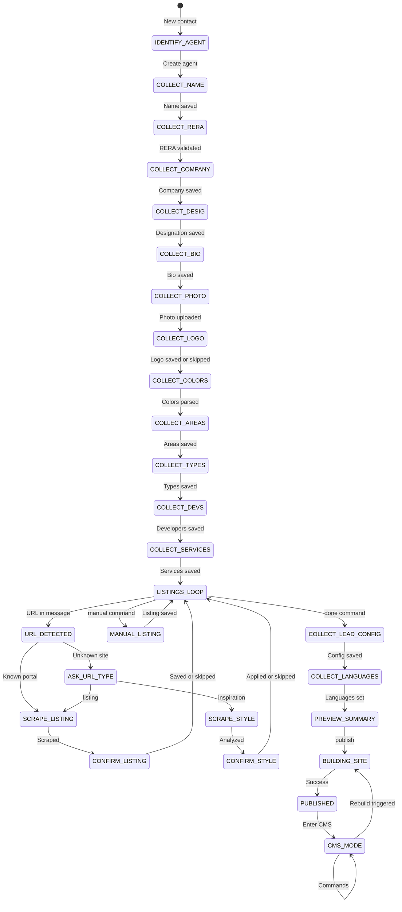

# Auro Agent Sites - Architecture & Implementation Plan

## Overall Assessment

✅ **Architecturally sound** for Netlify + Bird + Claude + rtrvr.ai stack.

✅ **Cleanly separated**: Twilio (legacy) vs Bird (agent sites), Core Auro flows vs `/sites` microsites, AgentConfig (inputs) vs AgentSiteDocument (renderable schema).

✅ **Implementation-ready**: Task breakdown is detailed enough to hand to an AI pair programmer or VA.

### What Is Especially Good
- **Multi-tenant model** (Brokerage → Agent → AgentConfig/SiteDocument) is well captured
- **WhatsApp CMS commands** (ADD/UPDATE LISTING, CHANGE COLORS, etc.) map directly to AgentConfig mutations
- **Scraping layer** via Netlify → rtrvr.ai is cleanly separated (not coupled to WhatsApp directly)
- **Claude builder** is constrained to emit only AgentSiteDocument JSON with schema validation + retries
- **Netlify split** (core app vs sites app) and DNS for sites.auroapp.com are well thought out

---

> **Product**: WhatsApp-driven real estate agent website builder  
> **Pricing**: 299 USD / ~1,000 AED per agent per month  
> **Strategic Goal**: Lead-gen wedge into enterprise Auro (voice agents, lead nurturing, brokerage-wide automations)

---

## 1. Architecture Diagram & Responsibilities

### System Overview (Text Diagram)

```
┌─────────────────────────────────────────────────────────────────────────────────┐
│                              WHATSAPP LAYER                                      │
├─────────────────────────────────────────────────────────────────────────────────┤
│  ┌─────────────────────┐              ┌─────────────────────┐                   │
│  │   Twilio Number     │              │   Bird BSP Number   │                   │
│  │   (Existing Auro)   │              │   (Agent Sites)     │                   │
│  │   Lead nurturing,   │              │   Onboarding, CMS   │                   │
│  │   bookings, voice   │              │   commands, updates │                   │
│  └──────────┬──────────┘              └──────────┬──────────┘                   │
│             │                                    │                              │
│             ▼                                    ▼                              │
│  /.netlify/functions/whatsapp        /.netlify/functions/whatsapp-bird         │
│  (unchanged)                         (NEW)                                      │
└─────────────────────────────────────────────────────────────────────────────────┘
                                       │
                                       ▼
┌─────────────────────────────────────────────────────────────────────────────────┐
│                           NETLIFY FUNCTIONS (Backend)                           │
├─────────────────────────────────────────────────────────────────────────────────┤
│                                                                                 │
│  EXISTING                           NEW FUNCTIONS                               │
│  ────────                           ─────────────                               │
│  • whatsapp.ts (Twilio)             • whatsapp-bird.ts (Bird webhook + state)   │
│  • vapi.ts / vapi-llm.ts            • scrape-listing.ts (rtrvr.ai → listing)    │
│  • rag-api.ts / rag-query.ts        • scrape-site-style.ts (rtrvr.ai → style)   │
│  • booking-notify.ts                • build-site.ts (Claude → AgentSiteDoc)     │
│  • listings-helper.ts               • site-by-slug.ts (GET /api/sites/:slug)    │
│  • image-proxy.ts                   • agent-domain.ts (custom domain mgmt)      │
│                                                                                 │
└────────────────────────────────────────┬────────────────────────────────────────┘
                                         │
              ┌──────────────────────────┼──────────────────────────┐
              │                          │                          │
              ▼                          ▼                          ▼
┌─────────────────────────┐ ┌─────────────────────────┐ ┌─────────────────────────┐
│      RTRVR.AI           │ │      CLAUDE API         │ │      SUPABASE           │
│   (Scraping Engine)     │ │   (AI Builder)          │ │   (Data Layer)          │
├─────────────────────────┤ ├─────────────────────────┤ ├─────────────────────────┤
│ • Listing extraction    │ │ • Claude 3.5 Sonnet or  │ │ Tables:                 │
│ • Site style analysis   │ │   Claude 3 Opus         │ │ • brokerages            │
│ • Natural language      │ │ • AgentConfig → JSON    │ │ • agents                │
│   browsing commands     │ │ • AgentSiteDocument     │ │ • agent_configs         │
│                         │ │   generation            │ │ • agent_site_documents  │
│                         │ │                         │ │ • agent_domains         │
│                         │ │                         │ │ • enterprise_leads      │
│                         │ │                         │ │ • site_conversations    │
└─────────────────────────┘ └─────────────────────────┘ └─────────────────────────┘
                                         │
                                         ▼
┌─────────────────────────────────────────────────────────────────────────────────┐
│                         SITES FRONTEND (React SPA)                              │
├─────────────────────────────────────────────────────────────────────────────────┤
│  Location: /sites folder in repo                                                │
│  Hosting: Separate Netlify site bound to sites.auroapp.com                      │
│                                                                                 │
│  Routes:                                                                        │
│  • sites.auroapp.com/[agentSlug]     → Agent microsite                          │
│  • sites.auroapp.com/[slug]/ar       → Arabic version                           │
│  • agent-custom-domain.com           → Custom domain (DNS alias)                │
│                                                                                 │
│  Data Fetch:                                                                    │
│  • GET https://auro-app.netlify.app/.netlify/functions/site-by-slug?slug=X      │
│  • Returns AgentSiteDocument + runtime flags                                    │
│                                                                                 │
│  CTAs link to:                                                                  │
│  • wa.me/<birdNumber>?text=<prefilled>                                          │
│                                                                                 │
└─────────────────────────────────────────────────────────────────────────────────┘
```

### Component Responsibilities

#### WhatsApp Layer

| Component | Responsibility |
|-----------|----------------|
| **Twilio Number** | Existing Auro flows: lead nurturing, property search, booking, voice calls. Unchanged. |
| **Bird BSP Number** | Agent Sites product: onboarding, profile collection, listing management, site publishing, CMS commands. |

#### Netlify Functions (New)

| Function | Purpose | Input | Output |
|----------|---------|-------|--------|
| [`whatsapp-bird.ts`](netlify/functions/whatsapp-bird.ts) | Bird webhook handler + conversation state machine | Bird webhook payload | TwiML-like response or Bird message API call |
| [`scrape-listing.ts`](netlify/functions/scrape-listing.ts) | Extract listing data from portal URLs via rtrvr.ai | `{ url: string }` | `ScrapedListingDraft` |
| [`scrape-site-style.ts`](netlify/functions/scrape-site-style.ts) | Analyze website for style inspiration via rtrvr.ai | `{ url: string }` | `SiteStyleProfile` |
| [`build-site.ts`](netlify/functions/build-site.ts) | Invoke Claude to generate AgentSiteDocument | `{ agentId: string }` | `AgentSiteDocument` |
| [`site-by-slug.ts`](netlify/functions/site-by-slug.ts) | Public API for microsites to fetch site data | `?slug=agent-slug` | `AgentSiteDocument` |
| [`agent-domain.ts`](netlify/functions/agent-domain.ts) | Manage custom domain connections via Netlify API | `{ agentId, domain, action }` | Status |

#### Data Layer (Supabase)

| Table | Purpose |
|-------|---------|
| `brokerages` | Multi-tenant organizations (optional for solo agents) |
| `agents` | Individual agent records linked to brokerage |
| `agent_configs` | Profile, branding, focus, listings, leadConfig, styleProfile |
| `agent_site_documents` | Versioned Claude-generated site schemas |
| `agent_domains` | Custom domain mappings |
| `site_conversations` | WhatsApp conversation state for Bird number |
| `enterprise_leads` | Upsell leads captured from agents/microsites |

#### Shared Code

| Location | Contents |
|----------|----------|
| `/shared/types/agent.ts` | `AgentConfig`, `Listing`, `SiteStyleProfile` interfaces |
| `/shared/types/site-document.ts` | `AgentSiteDocument`, section types |
| `/shared/types/scraping.ts` | `ScrapedListingDraft`, scraping-related types |
| `/lib/aiBuilder/` | Claude builder module (prompt, validation, retry) |
| `/lib/birdClient/` | Bird BSP API client utilities |
| `/lib/rtrvrClient/` | rtrvr.ai API client |

---

## 2. Data Model: JSON + TypeScript Interfaces

### 2.1 Multi-Tenant Model

```typescript
// /shared/types/tenant.ts

interface Brokerage {
  id: string;                    // UUID
  name: string;                  // "Provident Real Estate"
  slug: string;                  // "provident"
  primaryContactName: string;
  primaryContactEmail: string;
  primaryContactPhone: string;
  numAgents: number;
  plan: "starter" | "professional" | "enterprise";
  createdAt: string;             // ISO timestamp
  updatedAt: string;
}

interface Agent {
  id: string;                    // UUID
  brokerageId: string | null;    // NULL for solo agents
  phone: string;                 // WhatsApp phone (Bird number contact)
  email: string;
  role: "agent" | "team_lead" | "manager" | "owner";
  status: "pending" | "onboarding" | "active" | "suspended";
  createdAt: string;
  lastActiveAt: string;
}
```

### 2.2 AgentConfig (Collected via WhatsApp)

```typescript
// /shared/types/agent.ts

type ConfigStatus = "draft" | "ready" | "published";
type ListingType = "rent" | "sale" | "offplan";
type ListingStatus = "available" | "sold" | "reserved" | "rented";
type ListingSource = "manual" | "portal" | "mixed";
type ThemeVariant = "light" | "darkGold" | "darkBlue" | "minimal";
type PrimaryChannel = "whatsapp" | "phone" | "email";

interface Listing {
  id: string;                     // UUID
  title: string;
  towerOrCommunity: string;
  type: ListingType;
  price: number;
  currency: string;               // "AED" | "USD"
  beds: number;
  baths: number;
  sizeSqft: number;
  features: string[];
  photos: string[];               // URLs
  status: ListingStatus;
  handoverInfo?: string;          // For offplan
  description?: string;
  portalUrl?: string;             // Source URL if scraped
  source: ListingSource;
  createdAt: string;
  updatedAt: string;
}

interface LeadConfig {
  primaryChannel: PrimaryChannel;
  whatsappNumber: string;         // Bird number or agent's personal
  ctaTexts: {
    primary: string;              // "Chat with me on WhatsApp"
    secondary?: string;           // "Schedule a viewing"
  };
}

interface SiteStyleProfile {
  sourceUrl?: string;             // Inspiration site URL
  primaryColor?: string;          // "#1a365d"
  secondaryColor?: string;        // "#c9a227"
  fontHints?: string[];           // ["serif", "elegant", "Playfair Display"]
  layoutHints?: string[];         // ["hero-full-width", "card-grid", "minimal-nav"]
  toneHints?: string[];           // ["luxury", "professional", "family-friendly"]
  examplePhrases?: string[];      // Sample copy from inspiration site
}

interface AgentConfig {
  id: string;                     // UUID
  agentId: string;                // FK to agents.id
  brokerageId?: string;           // FK to brokerages.id (optional)
  slug: string;                   // URL slug: "sarah-ahmed"
  status: ConfigStatus;

  // Identity
  name: string;
  designation: string;            // "Senior Property Consultant"
  company: string;                // "Provident Real Estate"
  reraNumber: string;             // "BRN-12345"
  phone: string;
  email: string;
  location: string;               // "Dubai Marina Office"
  languages: string[];            // ["en", "ar", "hi"]
  bio?: string;                   // Agent story/about

  // Branding
  primaryColor: string;
  secondaryColor: string;
  themeVariant: ThemeVariant;
  logoUrl?: string;
  profilePhotoUrl?: string;

  // Focus
  areas: string[];                // ["Dubai Marina", "JBR", "Palm Jumeirah"]
  propertyTypes: string[];        // ["apartment", "villa", "penthouse"]
  developers: string[];           // ["Emaar", "Damac", "Nakheel"]

  // Services
  services: string[];             // ["Buy", "Sell", "Rent", "Property Management"]
  differentiators: string[];      // ["10+ years experience", "Fluent in 5 languages"]

  // Listings
  listings: Listing[];

  // Lead Config
  leadConfig: LeadConfig;

  // Style Profile (from inspiration site)
  styleProfile?: SiteStyleProfile;

  // Build Control
  needsSiteRebuild: boolean;      // True if changes require Claude rebuild
  lastBuiltAt?: string;           // Last successful build timestamp

  // Timestamps
  createdAt: string;
  updatedAt: string;
  publishedAt?: string;
}
```

### 2.2.1 Rebuild vs Direct Update Decision Matrix

| Change Type | Requires Claude Rebuild? | Direct Update? |
|-------------|--------------------------|----------------|
| CTA text changes | ❌ No | ✅ Yes |
| Color changes (primary/secondary) | ❌ No | ✅ Yes |
| Add/remove listing (no layout change) | ❌ No | ✅ Yes |
| Update listing price/status | ❌ No | ✅ Yes |
| Profile photo change | ❌ No | ✅ Yes |
| Bio/About text change | ✅ Yes | ❌ No |
| Add/remove language (EN↔AR) | ✅ Yes | ❌ No |
| Change theme variant | ✅ Yes | ❌ No |
| Apply new SiteStyleProfile | ✅ Yes | ❌ No |
| First publish | ✅ Yes | N/A |
| Add new section type | ✅ Yes | ❌ No |

**Implementation**: When processing CMS commands, set `needsSiteRebuild = true` only for structural changes. A background job or explicit "REBUILD" command triggers Claude when flag is true.

### 2.3 Scraping Types

```typescript
// /shared/types/scraping.ts

type PortalSource = "bayut" | "propertyFinder" | "dubizzle" | "developer" | "other";

interface ScrapedListingDraft {
  sourceUrl: string;
  source: PortalSource;
  title?: string;
  towerOrCommunity?: string;
  type?: ListingType;
  price?: number;
  currency?: string;
  beds?: number;
  baths?: number;
  sizeSqft?: number;
  features?: string[];
  photos?: string[];
  description?: string;
  agentName?: string;             // Scraped agent info (may differ from our agent)
  scrapedAt: string;
  confidence: number;             // 0-1 confidence score
}

// Rate limiting for scraping
interface AgentScrapeQuota {
  agentId: string;
  dailyLimit: number;             // Default: 30 URLs/day
  usedToday: number;
  resetAt: string;                // Next midnight UTC
}

interface ScrapeListingRequest {
  url: string;
  agentId: string;
}

interface ScrapeStyleRequest {
  url: string;
  agentId: string;
}
```

### 2.4 AgentSiteDocument (Claude Output)

```typescript
// /shared/types/site-document.ts

type SectionType = 
  | "hero" 
  | "about" 
  | "services" 
  | "focusAreas" 
  | "listingsGrid" 
  | "testimonials" 
  | "contact" 
  | "faq" 
  | "ctaBand"
  | "stats"
  | "developers";

type LanguageCode = "en" | "ar";

// Section Content Types
interface HeroContent {
  headline: string;
  subheadline: string;
  backgroundImage?: string;
  primaryCTA: { text: string; action: string };
  secondaryCTA?: { text: string; action: string };
}

interface AboutContent {
  title: string;
  paragraphs: string[];
  photo?: string;
  highlights?: string[];
}

interface ServiceCard {
  title: string;
  description: string;
  icon: string;                   // Icon name or URL
}

interface ServicesContent {
  title: string;
  subtitle?: string;
  cards: ServiceCard[];
}

interface FocusAreaItem {
  name: string;
  description: string;
  image?: string;
}

interface FocusAreasContent {
  title: string;
  subtitle?: string;
  areas: FocusAreaItem[];
}

interface ListingsGridContent {
  title: string;
  subtitle?: string;
  groupBy?: "type" | "area" | "none";
  sortBy?: "price" | "newest" | "featured";
  showFilters: boolean;
  emptyMessage?: string;
}

interface Testimonial {
  quote: string;
  name: string;
  role?: string;
  photo?: string;
}

interface TestimonialsContent {
  title: string;
  testimonials: Testimonial[];
}

interface ContactContent {
  title: string;
  description?: string;
  whatsappCTA: string;
  showForm: boolean;
  formFields?: string[];
  locationInfo?: {
    address: string;
    mapEmbed?: string;
  };
}

interface FAQItem {
  question: string;
  answer: string;
}

interface FAQContent {
  title: string;
  items: FAQItem[];
}

interface CTABandContent {
  headline: string;
  subtext?: string;
  buttonText: string;
  buttonAction: string;
}

interface StatsContent {
  title?: string;
  stats: Array<{
    value: string;
    label: string;
  }>;
}

interface DevelopersContent {
  title: string;
  subtitle?: string;
  developers: Array<{
    name: string;
    logo?: string;
    description?: string;
  }>;
}

// Union type for section content
type SectionContent = 
  | HeroContent 
  | AboutContent 
  | ServicesContent 
  | FocusAreasContent
  | ListingsGridContent
  | TestimonialsContent
  | ContactContent
  | FAQContent
  | CTABandContent
  | StatsContent
  | DevelopersContent;

// Section with multilingual content
interface Section<T extends SectionContent = SectionContent> {
  id: string;
  type: SectionType;
  order: number;
  visible: boolean;
  content: {
    en: T;
    ar?: T;
  };
}

// Main Document
interface AgentSiteDocument {
  id: string;                     // UUID
  agentId: string;
  configId: string;               // FK to agent_configs.id
  slug: string;
  version: number;
  languageCodes: LanguageCode[];

  meta: {
    pageTitle: {
      en: string;
      ar?: string;
    };
    metaDescription: {
      en: string;
      ar?: string;
    };
    canonicalUrl?: string;
    ogImage?: string;
  };

  theme: {
    primaryColor: string;
    secondaryColor: string;
    variant: ThemeVariant;
    logoUrl?: string;
  };

  sections: Section[];

  // Runtime data (not generated by Claude)
  listings: Listing[];            // Passed through from AgentConfig

  generatedAt: string;
  generatedBy: string;            // Model name: "claude-3.5-sonnet-20241022"
  tokenUsage?: {
    input: number;
    output: number;
  };
}
```

### 2.5 Example JSON: Minimal AgentConfig

```json
{
  "id": "cfg_123e4567-e89b-12d3-a456-426614174000",
  "agentId": "agt_789e4567-e89b-12d3-a456-426614174001",
  "brokerageId": "brk_456e4567-e89b-12d3-a456-426614174002",
  "slug": "sarah-ahmed",
  "status": "ready",

  "name": "Sarah Ahmed",
  "designation": "Senior Property Consultant",
  "company": "Provident Real Estate",
  "reraNumber": "BRN-54321",
  "phone": "+971501234567",
  "email": "sarah@provident.ae",
  "location": "Dubai Marina Office",
  "languages": ["en", "ar"],
  "bio": "With over 8 years of experience in Dubai real estate, I specialize in waterfront properties and helping families find their dream homes.",

  "primaryColor": "#1a365d",
  "secondaryColor": "#c9a227",
  "themeVariant": "darkGold",
  "logoUrl": "https://storage.auroapp.com/logos/provident.png",
  "profilePhotoUrl": "https://storage.auroapp.com/agents/sarah-ahmed.jpg",

  "areas": ["Dubai Marina", "JBR", "Palm Jumeirah"],
  "propertyTypes": ["apartment", "penthouse"],
  "developers": ["Emaar", "Select Group"],

  "services": ["Buy", "Sell", "Rent", "Investment Advisory"],
  "differentiators": [
    "8+ years Dubai Marina specialist",
    "Fluent in Arabic, English, Hindi",
    "Over 200 successful transactions"
  ],

  "listings": [
    {
      "id": "lst_001",
      "title": "Stunning 2BR with Full Marina View",
      "towerOrCommunity": "Marina Gate 1",
      "type": "sale",
      "price": 2800000,
      "currency": "AED",
      "beds": 2,
      "baths": 3,
      "sizeSqft": 1450,
      "features": ["Marina View", "High Floor", "Upgraded Kitchen", "Balcony"],
      "photos": [
        "https://storage.auroapp.com/listings/lst_001/1.jpg",
        "https://storage.auroapp.com/listings/lst_001/2.jpg"
      ],
      "status": "available",
      "description": "Beautifully upgraded 2-bedroom apartment with breathtaking marina views.",
      "source": "manual",
      "createdAt": "2024-01-15T10:00:00Z",
      "updatedAt": "2024-01-15T10:00:00Z"
    },
    {
      "id": "lst_002",
      "title": "Luxury 3BR Penthouse in JBR",
      "towerOrCommunity": "Sadaf 7",
      "type": "sale",
      "price": 5500000,
      "currency": "AED",
      "beds": 3,
      "baths": 4,
      "sizeSqft": 2800,
      "features": ["Sea View", "Private Terrace", "Duplex", "Smart Home"],
      "photos": [
        "https://bayut.com/property/img1.jpg"
      ],
      "status": "available",
      "portalUrl": "https://www.bayut.com/property/details-123456.html",
      "source": "portal",
      "createdAt": "2024-01-16T14:30:00Z",
      "updatedAt": "2024-01-16T14:30:00Z"
    }
  ],

  "leadConfig": {
    "primaryChannel": "whatsapp",
    "whatsappNumber": "+971507654321",
    "ctaTexts": {
      "primary": "Chat with Sarah on WhatsApp",
      "secondary": "Book a Viewing"
    }
  },

  "styleProfile": {
    "sourceUrl": "https://www.luxury-agent-example.com",
    "primaryColor": "#1a365d",
    "secondaryColor": "#c9a227",
    "fontHints": ["serif", "elegant"],
    "layoutHints": ["hero-full-width", "card-grid"],
    "toneHints": ["luxury", "professional"]
  },

  "createdAt": "2024-01-10T08:00:00Z",
  "updatedAt": "2024-01-16T14:30:00Z"
}
```

### 2.6 Example JSON: Minimal AgentSiteDocument

```json
{
  "id": "doc_abc123",
  "agentId": "agt_789e4567-e89b-12d3-a456-426614174001",
  "configId": "cfg_123e4567-e89b-12d3-a456-426614174000",
  "slug": "sarah-ahmed",
  "version": 1,
  "languageCodes": ["en", "ar"],

  "meta": {
    "pageTitle": {
      "en": "Sarah Ahmed | Dubai Marina Property Expert | Provident Real Estate",
      "ar": "سارة أحمد | خبيرة عقارات دبي مارينا | بروفيدنت العقارية"
    },
    "metaDescription": {
      "en": "Find your dream waterfront property in Dubai Marina, JBR & Palm Jumeirah with Sarah Ahmed. 8+ years experience, 200+ successful transactions.",
      "ar": "اعثر على عقار أحلامك على الواجهة البحرية في دبي مارينا وجي بي آر ونخلة جميرا مع سارة أحمد."
    },
    "canonicalUrl": "https://sites.auroapp.com/sarah-ahmed",
    "ogImage": "https://storage.auroapp.com/agents/sarah-ahmed-og.jpg"
  },

  "theme": {
    "primaryColor": "#1a365d",
    "secondaryColor": "#c9a227",
    "variant": "darkGold",
    "logoUrl": "https://storage.auroapp.com/logos/provident.png"
  },

  "sections": [
    {
      "id": "hero-1",
      "type": "hero",
      "order": 1,
      "visible": true,
      "content": {
        "en": {
          "headline": "Your Waterfront Property Expert",
          "subheadline": "Specializing in Dubai Marina, JBR & Palm Jumeirah premium properties",
          "backgroundImage": "https://storage.auroapp.com/agents/sarah-hero-bg.jpg",
          "primaryCTA": {
            "text": "Chat with Sarah",
            "action": "whatsapp"
          },
          "secondaryCTA": {
            "text": "View Properties",
            "action": "#listings"
          }
        },
        "ar": {
          "headline": "خبيرتك في العقارات البحرية",
          "subheadline": "متخصصة في عقارات دبي مارينا وجي بي آر ونخلة جميرا الفاخرة",
          "backgroundImage": "https://storage.auroapp.com/agents/sarah-hero-bg.jpg",
          "primaryCTA": {
            "text": "تواصل مع سارة",
            "action": "whatsapp"
          },
          "secondaryCTA": {
            "text": "عرض العقارات",
            "action": "#listings"
          }
        }
      }
    },
    {
      "id": "about-1",
      "type": "about",
      "order": 2,
      "visible": true,
      "content": {
        "en": {
          "title": "About Sarah",
          "paragraphs": [
            "With over 8 years of experience in Dubai's dynamic real estate market, I've built my reputation on deep market knowledge and genuine client relationships.",
            "Having completed over 200 successful transactions, I understand that buying or selling property is one of life's biggest decisions. That's why I'm committed to making the process seamless and transparent."
          ],
          "photo": "https://storage.auroapp.com/agents/sarah-ahmed.jpg",
          "highlights": [
            "8+ years Dubai Marina specialist",
            "200+ successful transactions",
            "Fluent in English, Arabic & Hindi"
          ]
        },
        "ar": {
          "title": "عن سارة",
          "paragraphs": [
            "مع أكثر من 8 سنوات من الخبرة في سوق العقارات النابض في دبي، بنيت سمعتي على المعرفة العميقة بالسوق والعلاقات الحقيقية مع العملاء.",
            "بعد إتمام أكثر من 200 صفقة ناجحة، أدرك أن شراء أو بيع العقارات هو من أكبر القرارات في الحياة."
          ],
          "photo": "https://storage.auroapp.com/agents/sarah-ahmed.jpg",
          "highlights": [
            "أكثر من 8 سنوات متخصصة في دبي مارينا",
            "أكثر من 200 صفقة ناجحة",
            "تتحدث الإنجليزية والعربية والهندية"
          ]
        }
      }
    },
    {
      "id": "services-1",
      "type": "services",
      "order": 3,
      "visible": true,
      "content": {
        "en": {
          "title": "How I Can Help",
          "subtitle": "Comprehensive real estate services tailored to your needs",
          "cards": [
            {
              "title": "Buy",
              "description": "Find your perfect property with expert guidance through every step of the purchase process.",
              "icon": "home"
            },
            {
              "title": "Sell",
              "description": "Maximize your property's value with strategic marketing and negotiation expertise.",
              "icon": "tag"
            },
            {
              "title": "Rent",
              "description": "Whether you're a tenant or landlord, I'll ensure a smooth rental experience.",
              "icon": "key"
            },
            {
              "title": "Investment Advisory",
              "description": "Data-driven insights to help you make smart investment decisions in Dubai's market.",
              "icon": "trending-up"
            }
          ]
        }
      }
    },
    {
      "id": "focus-1",
      "type": "focusAreas",
      "order": 4,
      "visible": true,
      "content": {
        "en": {
          "title": "Areas I Specialize In",
          "areas": [
            {
              "name": "Dubai Marina",
              "description": "The vibrant heart of waterfront living with world-class amenities and stunning views.",
              "image": "https://storage.auroapp.com/areas/dubai-marina.jpg"
            },
            {
              "name": "JBR",
              "description": "Beachfront lifestyle at its finest with The Walk and direct beach access.",
              "image": "https://storage.auroapp.com/areas/jbr.jpg"
            },
            {
              "name": "Palm Jumeirah",
              "description": "Iconic island living with exclusive villas and premium apartments.",
              "image": "https://storage.auroapp.com/areas/palm.jpg"
            }
          ]
        }
      }
    },
    {
      "id": "listings-1",
      "type": "listingsGrid",
      "order": 5,
      "visible": true,
      "content": {
        "en": {
          "title": "Featured Properties",
          "subtitle": "Hand-picked selections from my current portfolio",
          "groupBy": "none",
          "sortBy": "featured",
          "showFilters": true,
          "emptyMessage": "New properties coming soon. Contact me for off-market opportunities."
        }
      }
    },
    {
      "id": "cta-1",
      "type": "ctaBand",
      "order": 6,
      "visible": true,
      "content": {
        "en": {
          "headline": "Ready to Find Your Dream Property?",
          "subtext": "Let's discuss your requirements over a quick WhatsApp chat",
          "buttonText": "Chat with Sarah Now",
          "buttonAction": "whatsapp"
        },
        "ar": {
          "headline": "مستعد للعثور على عقار أحلامك؟",
          "subtext": "دعنا نناقش متطلباتك عبر محادثة واتساب سريعة",
          "buttonText": "تواصل مع سارة الآن",
          "buttonAction": "whatsapp"
        }
      }
    },
    {
      "id": "contact-1",
      "type": "contact",
      "order": 7,
      "visible": true,
      "content": {
        "en": {
          "title": "Get in Touch",
          "description": "I'm here to help with all your Dubai real estate needs.",
          "whatsappCTA": "Chat with Sarah on WhatsApp",
          "showForm": false,
          "locationInfo": {
            "address": "Marina Plaza, Dubai Marina, Dubai, UAE"
          }
        }
      }
    }
  ],

  "listings": [],

  "generatedAt": "2024-01-16T15:00:00Z",
  "generatedBy": "claude-3.5-sonnet-20241022",
  "tokenUsage": {
    "input": 2450,
    "output": 3200
  }
}
```

---

## 3. WhatsApp Conversation Flow (Bird BSP Number)

### 3.1 State Machine Overview

```
┌─────────────┐
│   START     │
└──────┬──────┘
       │ New contact messages Bird number
       ▼
┌─────────────────┐
│ IDENTIFY_AGENT  │ ── Phone lookup → existing agent? ──┐
└────────┬────────┘                                     │
         │ New agent                                    │
         ▼                                              │
┌─────────────────┐                                     │
│ COLLECT_NAME    │◄────────────────────────────────────┘
└────────┬────────┘   (if existing but incomplete)
         ▼
┌─────────────────┐
│ COLLECT_RERA    │
└────────┬────────┘
         ▼
┌─────────────────┐
│ COLLECT_COMPANY │
└────────┬────────┘
         ▼
┌─────────────────┐
│ COLLECT_DESIG   │ (designation)
└────────┬────────┘
         ▼
┌─────────────────┐
│ COLLECT_BIO     │
└────────┬────────┘
         ▼
┌─────────────────┐
│ COLLECT_PHOTO   │ (profile photo)
└────────┬────────┘
         ▼
┌─────────────────┐
│ COLLECT_LOGO    │ (optional company logo)
└────────┬────────┘
         ▼
┌─────────────────┐
│ COLLECT_COLORS  │ (primary, secondary, theme)
└────────┬────────┘
         ▼
┌─────────────────┐
│ COLLECT_AREAS   │ (focus areas)
└────────┬────────┘
         ▼
┌─────────────────┐
│ COLLECT_TYPES   │ (property types)
└────────┬────────┘
         ▼
┌─────────────────┐
│ COLLECT_DEVS    │ (key developers)
└────────┬────────┘
         ▼
┌─────────────────┐
│ COLLECT_SERVICES│
└────────┬────────┘
         ▼
┌─────────────────────┐
│ LISTINGS_LOOP_START │◄─────────────────┐
└─────────┬───────────┘                  │
          │                              │
          ▼                              │
    ┌─────────────┐                      │
    │ URL detected│───Yes───┐            │
    └──────┬──────┘         │            │
           │ No             ▼            │
           │      ┌─────────────────┐    │
           │      │ ASK_URL_TYPE    │    │
           │      │ listing or      │    │
           │      │ inspiration?    │    │
           │      └────────┬────────┘    │
           │               │             │
           │    ┌──────────┴──────────┐  │
           │    ▼                     ▼  │
           │ ┌────────────┐  ┌────────────────┐
           │ │SCRAPE_LIST │  │SCRAPE_STYLE    │
           │ │via rtrvr.ai│  │via rtrvr.ai    │
           │ └─────┬──────┘  └───────┬────────┘
           │       │                 │
           │       ▼                 ▼
           │ ┌────────────┐  ┌────────────────┐
           │ │CONFIRM_LIST│  │CONFIRM_STYLE   │
           │ │show summary│  │show colors/tone│
           │ └─────┬──────┘  └───────┬────────┘
           │       │                 │
           ▼       ▼                 │
    ┌──────────────────┐             │
    │ MANUAL_LISTING   │◄────────────┘
    │ (if no URL)      │
    └────────┬─────────┘
             │
             ▼
    ┌──────────────────┐
    │ LISTING_SAVED    │
    │ Add another? Y/N │───Yes───────────┘
    └────────┬─────────┘
             │ No / "done"
             ▼
┌─────────────────────┐
│ COLLECT_LEAD_CONFIG │ (CTA text, preferred channel)
└─────────┬───────────┘
          ▼
┌─────────────────────┐
│ COLLECT_LANGUAGES   │ (EN, AR, both)
└─────────┬───────────┘
          ▼
┌─────────────────────┐
│ PREVIEW_SUMMARY     │ (show what we have)
│ Ready to publish?   │
└─────────┬───────────┘
          │ Yes
          ▼
┌─────────────────────┐
│ BUILDING_SITE       │ (call Claude builder)
└─────────┬───────────┘
          ▼
┌─────────────────────┐
│ PUBLISHED           │ (share site URL)
│ Enter CMS_MODE      │
└─────────┬───────────┘
          ▼
┌─────────────────────┐
│ CMS_MODE            │ (listen for commands)
│ Ongoing updates     │
└─────────────────────┘
```

### 3.2 Onboarding Steps Detail

| Step | Bot Message | Expected Input | Validation | Stores To |
|------|-------------|----------------|------------|-----------|
| `IDENTIFY_AGENT` | Welcome! Let's build your real estate website. What's your full name? | Text | Non-empty, 2+ words preferred | `agent.name` (create agent record) |
| `COLLECT_NAME` | (if existing) I see you started before. Let's continue. Confirm your name: | Text | Non-empty | `agentConfig.name` |
| `COLLECT_RERA` | What's your RERA/BRN number? | Text | Regex: `BRN-\d+` or `\d{5,}` | `agentConfig.reraNumber` |
| `COLLECT_COMPANY` | Which brokerage are you with? | Text | Non-empty | `agentConfig.company` |
| `COLLECT_DESIG` | What's your designation? (e.g., Senior Consultant, Property Advisor) | Text | Non-empty | `agentConfig.designation` |
| `COLLECT_BIO` | Tell me about yourself in 2-3 sentences. This will appear on your About section. | Text | 50-500 chars | `agentConfig.bio` |
| `COLLECT_PHOTO` | Send me a professional headshot photo. | Image | JPEG/PNG, < 5MB | Upload → `agentConfig.profilePhotoUrl` |
| `COLLECT_LOGO` | Send your company logo (or type "skip"). | Image or "skip" | JPEG/PNG/SVG | Upload → `agentConfig.logoUrl` |
| `COLLECT_COLORS` | What colors represent your brand? Send hex codes or describe (e.g., "navy blue and gold"). | Text | Parse colors or use defaults | `agentConfig.primaryColor`, `secondaryColor` |
| `COLLECT_AREAS` | Which areas do you specialize in? (e.g., Dubai Marina, Downtown, JBR) | Text | Split by comma | `agentConfig.areas[]` |
| `COLLECT_TYPES` | What property types do you focus on? (apartment, villa, townhouse, penthouse) | Text | Split by comma | `agentConfig.propertyTypes[]` |
| `COLLECT_DEVS` | Any specific developers you work with? (Emaar, Damac, Nakheel) or "skip" | Text | Split by comma or skip | `agentConfig.developers[]` |
| `COLLECT_SERVICES` | What services do you offer? (Buy, Sell, Rent, Property Management, Investment) | Text | Split by comma | `agentConfig.services[]` |

### 3.3 Listings Loop Detail

| Sub-State | Bot Message | Input | Action |
|-----------|-------------|-------|--------|
| `LISTINGS_LOOP_START` | Now let's add your listings. Send a property URL (Bayut, Property Finder) or type "manual" to enter details. | URL or "manual" or "done" | Route to scrape or manual flow |
| `ASK_URL_TYPE` | Is this a listing URL from a portal, or a website for style inspiration? Reply "listing" or "inspiration". | "listing" / "inspiration" | Route to scraper |
| `SCRAPE_LISTING` | Fetching listing details... | (processing) | Call `scrape-listing` |
| `CONFIRM_LISTING` | Here's what I found: [summary]. Reply "save" to add, "edit" to modify, or "skip". | "save" / "edit" / "skip" | Save to `agentConfig.listings[]` |
| `SCRAPE_STYLE` | Analyzing site style... | (processing) | Call `scrape-site-style` |
| `CONFIRM_STYLE` | Style captured: [colors, tone]. Reply "apply" or "skip". | "apply" / "skip" | Save to `agentConfig.styleProfile` |
| `MANUAL_LISTING` | Let's add a listing manually. What's the property title? | Text | Start manual listing flow |
| `MANUAL_*` | (Series of prompts for each listing field) | Various | Build `Listing` object |
| `LISTING_SAVED` | Listing saved! Add another? (send URL, "manual", or "done") | URL / "manual" / "done" | Loop or continue |

### 3.4 URL Detection & Routing

```typescript
// Pseudo-code for URL detection in whatsapp-bird.ts

function detectUrlType(message: string): UrlDetection {
  const urlMatch = message.match(/https?:\/\/[^\s]+/);
  if (!urlMatch) return { hasUrl: false };
  
  const url = urlMatch[0];
  const domain = new URL(url).hostname;
  
  // Known listing portals
  const portalDomains = [
    'bayut.com', 'www.bayut.com',
    'propertyfinder.ae', 'www.propertyfinder.ae',
    'dubizzle.com', 'www.dubizzle.com'
  ];
  
  if (portalDomains.some(d => domain.includes(d))) {
    return { hasUrl: true, url, type: 'listing', source: inferSource(domain) };
  }
  
  // Likely a full website - need to ask
  return { hasUrl: true, url, type: 'unknown' };
}
```

### 3.5 CMS Commands (Post-Publish)

| Command | Aliases | Bot Response | AgentConfig Change | Triggers Rebuild? |
|---------|---------|--------------|--------------------|--------------------|
| `ADD LISTING` | `new listing`, `add property` | Start listings loop | Add to `listings[]` | Yes |
| `REMOVE LISTING <title>` | `delete listing` | Confirm & remove | Remove from `listings[]` | Yes |
| `UPDATE LISTING <title>` | `edit listing` | Ask which field | Update listing fields | Yes |
| `UPDATE PRICE <title> <price>` | `change price` | Confirm change | Update `listing.price` | Yes (can be incremental) |
| `UPDATE BIO` | `change bio`, `edit about` | Ask for new bio | Update `bio` | Yes |
| `CHANGE COLORS <hex1> <hex2>` | `update colors` | Apply & preview | Update `primaryColor`, `secondaryColor` | Yes |
| `CHANGE CTA <text>` | `update cta` | Confirm | Update `leadConfig.ctaTexts.primary` | No (can be incremental) |
| `ADD TESTIMONIAL` | `new testimonial` | Ask for quote, name, role | Add to section via rebuild | Yes |
| `CHANGE LANGUAGE` | `add arabic`, `remove arabic` | Toggle languages | Update `languages[]` | Yes |
| `CONNECT DOMAIN <domain>` | `add domain` | Start domain flow | Update `agent_domains` | No |
| `VIEW STATS` | `analytics`, `traffic` | Show basic stats | None | No |
| `HELP` | `commands`, `?` | List all commands | None | No |

### 3.6 Bird BSP Event Handling

| Event Type | Handler Action |
|------------|----------------|
| `message.received` | Main handler - route to state machine |
| `message.status.delivered` | Log delivery confirmation |
| `message.status.read` | Log read receipt |
| `message.status.failed` | Log failure, maybe retry or alert |

### 3.7 Phone → Agent Mapping

1. **Primary Key**: `agents.phone` stores the WhatsApp phone number (international format, e.g., `+971501234567`)
2. **On First Contact**: 
   - Check `agents` table for matching phone
   - If not found, create new `agent` record with `status: 'onboarding'`
   - Create corresponding `site_conversations` record for state tracking
3. **Conversation State**: Stored in `site_conversations` table:
   ```typescript
   interface SiteConversation {
     id: string;
     agentId: string;
     currentState: string;        // "COLLECT_NAME", "LISTINGS_LOOP", etc.
     stateData: object;           // Temporary data being collected
     lastMessageAt: string;
     createdAt: string;
   }
   ```

---

## 4. Claude Builder Service Design

### 4.1 Module Structure

```
/lib/aiBuilder/
├── index.ts              # Main export
├── buildSite.ts          # Core builder function
├── prompts.ts            # System & user prompt templates
├── validation.ts         # Schema validation (Zod)
├── retry.ts              # Retry logic with backoff
└── types.ts              # Builder-specific types
```

### 4.2 Builder Function Interface

```typescript
// /lib/aiBuilder/buildSite.ts

interface BuildSiteInput {
  agentConfig: AgentConfig;
  styleProfile?: SiteStyleProfile;
  options?: {
    forceRebuild?: boolean;
    sectionsToInclude?: SectionType[];
    maxTokens?: number;
  };
}

interface BuildSiteOutput {
  document: AgentSiteDocument;
  tokenUsage: { input: number; output: number };
  model: string;
  latencyMs: number;
}

async function buildSite(input: BuildSiteInput): Promise<BuildSiteOutput>;
```

### 4.3 Prompt Design

#### System Prompt

```typescript
const SYSTEM_PROMPT = `You are a professional real estate website copywriter and UX designer. Your task is to generate a complete AgentSiteDocument JSON based on the provided AgentConfig.

CRITICAL RULES:
1. Output ONLY valid JSON matching the AgentSiteDocument schema. No markdown, no prose, no explanations.
2. Generate ORIGINAL, compelling copy - do NOT copy text from scraped listings, portals, or inspiration sites.
3. If a SiteStyleProfile is provided, use its colors/layout/tone hints but NEVER copy any exact wording from the inspiration site. Create fresh copy that matches the tone.
4. Maintain consistent tone across all sections based on style hints provided.
5. All text must be professional, persuasive, and suitable for a premium real estate agent.
6. For Arabic content: use formal Modern Standard Arabic appropriate for UAE business context.
7. Keep headlines punchy (under 10 words), descriptions concise (2-3 sentences max per paragraph).

SCHEMA REQUIREMENTS:
- Every section must have a unique "id" (format: "type-n", e.g., "hero-1")
- "order" must be sequential starting from 1
- "visible" should default to true
- If Arabic is requested, include "ar" key in content with fully translated content

SECTION GENERATION GUIDELINES:
- hero: Create an attention-grabbing headline that highlights the agent's unique value proposition
- about: Write a compelling personal story that builds trust and showcases expertise
- services: Frame each service as a benefit to the client, not just a feature
- focusAreas: Write brief, enticing descriptions of each area's lifestyle appeal
- listingsGrid: Use provided config settings, don't generate fake listings
- ctaBand: Create urgency without being pushy
- contact: Keep it simple and action-oriented

When styleProfile is provided:
- Adapt tone to match toneHints (e.g., "luxury" = sophisticated vocabulary, "family-friendly" = warm and approachable)
- Reference layoutHints in section structure suggestions
- Incorporate examplePhrases style (not exact wording) into copy`;
```

#### User Prompt Template

```typescript
function buildUserPrompt(config: AgentConfig, styleProfile?: SiteStyleProfile): string {
  // Compact config - remove unnecessary fields
  const compactConfig = {
    name: config.name,
    designation: config.designation,
    company: config.company,
    bio: config.bio,
    location: config.location,
    languages: config.languages,
    areas: config.areas,
    propertyTypes: config.propertyTypes,
    developers: config.developers,
    services: config.services,
    differentiators: config.differentiators,
    // Summarize listings instead of full objects
    listingsSummary: config.listings.map(l => ({
      title: l.title,
      type: l.type,
      area: l.towerOrCommunity,
      beds: l.beds
    })),
    leadConfig: config.leadConfig,
    theme: {
      primaryColor: config.primaryColor,
      secondaryColor: config.secondaryColor,
      variant: config.themeVariant
    }
  };

  let prompt = `Generate an AgentSiteDocument for this real estate agent:

AGENT CONFIG:
${JSON.stringify(compactConfig, null, 2)}

REQUIREMENTS:
- Languages: ${config.languages.join(', ')}
- Include sections: hero, about, services, focusAreas, listingsGrid, ctaBand, contact
- Theme colors: primary=${config.primaryColor}, secondary=${config.secondaryColor}
- Slug: ${config.slug}`;

  if (styleProfile) {
    prompt += `

STYLE PROFILE (from inspiration site):
- Tone: ${styleProfile.toneHints?.join(', ') || 'professional'}
- Layout hints: ${styleProfile.layoutHints?.join(', ') || 'standard'}
- Font style: ${styleProfile.fontHints?.join(', ') || 'modern'}`;
  }

  prompt += `

OUTPUT: Return only the complete AgentSiteDocument JSON object.`;

  return prompt;
}
```

### 4.4 Model Selection & Token Strategy

| Scenario | Model | Reasoning |
|----------|-------|-----------|
| Initial build | `claude-3-5-sonnet-20241022` | Best balance of quality and cost |
| Complex multilingual (3+ languages) | `claude-3-opus-20240229` | Better at nuanced translations |
| Minor updates (CTA, colors only) | Skip Claude, direct update | No AI needed |
| Retry after validation failure | Same model, stricter prompt | Add explicit error feedback |

**Token Optimization:**
- Remove `listings` array from prompt (pass summary only)
- Truncate `bio` to 500 chars max
- Don't send `styleProfile.examplePhrases` (just toneHints)
- Estimated tokens per build: ~2,500 input, ~3,500 output

### 4.5 Validation & Retry Logic

```typescript
// /lib/aiBuilder/validation.ts

import { z } from 'zod';

const AgentSiteDocumentSchema = z.object({
  id: z.string(),
  agentId: z.string(),
  configId: z.string(),
  slug: z.string(),
  version: z.number(),
  languageCodes: z.array(z.enum(['en', 'ar'])),
  meta: z.object({
    pageTitle: z.object({ en: z.string(), ar: z.string().optional() }),
    metaDescription: z.object({ en: z.string(), ar: z.string().optional() }),
    canonicalUrl: z.string().optional(),
    ogImage: z.string().optional()
  }),
  theme: z.object({
    primaryColor: z.string(),
    secondaryColor: z.string(),
    variant: z.enum(['light', 'darkGold', 'darkBlue', 'minimal']),
    logoUrl: z.string().optional()
  }),
  sections: z.array(z.object({
    id: z.string(),
    type: z.enum(['hero', 'about', 'services', 'focusAreas', 'listingsGrid', 
                  'testimonials', 'contact', 'faq', 'ctaBand', 'stats', 'developers']),
    order: z.number(),
    visible: z.boolean(),
    content: z.object({
      en: z.any(),
      ar: z.any().optional()
    })
  })),
  listings: z.array(z.any()),
  generatedAt: z.string(),
  generatedBy: z.string(),
  tokenUsage: z.object({
    input: z.number(),
    output: z.number()
  }).optional()
});

async function validateAndRetry(
  rawOutput: string,
  input: BuildSiteInput,
  attempt: number = 1
): Promise<AgentSiteDocument> {
  // Try to parse JSON
  let parsed: any;
  try {
    parsed = JSON.parse(rawOutput);
  } catch (e) {
    if (attempt >= 3) throw new Error('Failed to parse JSON after 3 attempts');
    // Retry with stricter prompt
    return retryBuild(input, attempt + 1, 'Output was not valid JSON');
  }

  // Validate against schema
  const result = AgentSiteDocumentSchema.safeParse(parsed);
  if (!result.success) {
    if (attempt >= 3) throw new Error(`Schema validation failed: ${result.error.message}`);
    return retryBuild(input, attempt + 1, `Schema errors: ${result.error.message}`);
  }

  return result.data;
}
```

### 4.6 Netlify Function: build-site.ts

```typescript
// Location: /netlify/functions/build-site.ts

import { Handler } from '@netlify/functions';
import { buildSite } from '../../lib/aiBuilder';
import { supabase } from '../../lib/supabaseClient';

export const handler: Handler = async (event) => {
  if (event.httpMethod !== 'POST') {
    return { statusCode: 405, body: 'Method not allowed' };
  }

  const { agentId } = JSON.parse(event.body || '{}');
  if (!agentId) {
    return { statusCode: 400, body: 'agentId required' };
  }

  // Load AgentConfig
  const { data: config, error } = await supabase
    .from('agent_configs')
    .select('*')
    .eq('agent_id', agentId)
    .single();

  if (error || !config) {
    return { statusCode: 404, body: 'Agent config not found' };
  }

  // Build site
  const result = await buildSite({
    agentConfig: config,
    styleProfile: config.style_profile
  });

  // Store document (versioned)
  const { data: existing } = await supabase
    .from('agent_site_documents')
    .select('version')
    .eq('agent_id', agentId)
    .order('version', { ascending: false })
    .limit(1)
    .single();

  const newVersion = (existing?.version || 0) + 1;

  await supabase.from('agent_site_documents').insert({
    ...result.document,
    version: newVersion
  });

  // Update config status
  await supabase
    .from('agent_configs')
    .update({ status: 'published', published_at: new Date().toISOString() })
    .eq('id', config.id);

  // Log usage for cost tracking
  await supabase.from('ai_usage_logs').insert({
    agent_id: agentId,
    operation: 'build_site',
    model: result.model,
    input_tokens: result.tokenUsage.input,
    output_tokens: result.tokenUsage.output,
    latency_ms: result.latencyMs
  });

  return {
    statusCode: 200,
    body: JSON.stringify({ 
      success: true, 
      siteUrl: `https://sites.auroapp.com/${config.slug}`,
      version: newVersion
    })
  };
};
```

---

## 5. Scraping via rtrvr.ai (Netlify Functions)

### 5.1 rtrvr.ai Client Module

```
/lib/rtrvrClient/
├── index.ts              # Main client
├── commands.ts           # NL command templates
└── types.ts              # Response types
```

```typescript
// /lib/rtrvrClient/index.ts

interface RtrvrConfig {
  apiKey: string;
  baseUrl: string;
  timeout: number;
}

interface RtrvrResponse {
  success: boolean;
  data: any;
  error?: string;
}

class RtrvrClient {
  constructor(private config: RtrvrConfig) {}

  async browse(command: string): Promise<RtrvrResponse> {
    const response = await fetch(`${this.config.baseUrl}/browse`, {
      method: 'POST',
      headers: {
        'Authorization': `Bearer ${this.config.apiKey}`,
        'Content-Type': 'application/json'
      },
      body: JSON.stringify({ command }),
      signal: AbortSignal.timeout(this.config.timeout)
    });

    return response.json();
  }
}
```

### 5.2 scrape-listing.ts

```typescript
// Location: /netlify/functions/scrape-listing.ts

import { Handler } from '@netlify/functions';
import { RtrvrClient } from '../../lib/rtrvrClient';
import { supabase } from '../../lib/supabaseClient';

const LISTING_SCRAPE_COMMAND = (url: string) => `
Go to ${url} and extract the property listing details.
Return a JSON object with these exact fields:
{
  "title": "property title/name",
  "towerOrCommunity": "building or community name",
  "type": "rent" or "sale" or "offplan",
  "price": number (no commas, just digits),
  "currency": "AED" or "USD",
  "beds": number of bedrooms (0 for studio),
  "baths": number of bathrooms,
  "sizeSqft": size in square feet (number),
  "features": ["feature1", "feature2", ...],
  "photos": ["url1", "url2", ...],
  "description": "full property description text"
}
Only return the JSON object, no other text.
`;

export const handler: Handler = async (event) => {
  if (event.httpMethod !== 'POST') {
    return { statusCode: 405, body: 'Method not allowed' };
  }

  const { url, agentId } = JSON.parse(event.body || '{}');
  if (!url || !agentId) {
    return { statusCode: 400, body: 'url and agentId required' };
  }

  // Check cache (avoid re-scraping same URL within 24h)
  const { data: cached } = await supabase
    .from('scrape_cache')
    .select('*')
    .eq('url', url)
    .eq('type', 'listing')
    .gte('scraped_at', new Date(Date.now() - 24 * 60 * 60 * 1000).toISOString())
    .single();

  if (cached) {
    return {
      statusCode: 200,
      body: JSON.stringify({ cached: true, data: cached.data })
    };
  }

  // Scrape via rtrvr.ai
  const client = new RtrvrClient({
    apiKey: process.env.RTRVR_API_KEY!,
    baseUrl: 'https://api.rtrvr.ai/v1',
    timeout: 60000
  });

  try {
    const result = await client.browse(LISTING_SCRAPE_COMMAND(url));
    
    if (!result.success) {
      return {
        statusCode: 422,
        body: JSON.stringify({ error: 'Scraping failed', details: result.error })
      };
    }

    // Normalize to ScrapedListingDraft
    const draft: ScrapedListingDraft = {
      sourceUrl: url,
      source: inferSource(url),
      ...result.data,
      scrapedAt: new Date().toISOString(),
      confidence: 0.9 // Could be calculated based on field completeness
    };

    // Cache result
    await supabase.from('scrape_cache').insert({
      url,
      type: 'listing',
      data: draft,
      scraped_at: new Date().toISOString()
    });

    return {
      statusCode: 200,
      body: JSON.stringify({ cached: false, data: draft })
    };

  } catch (error: any) {
    // Handle specific errors
    if (error.name === 'AbortError') {
      return { statusCode: 504, body: JSON.stringify({ error: 'Scraping timeout' }) };
    }
    return { statusCode: 500, body: JSON.stringify({ error: error.message }) };
  }
};

function inferSource(url: string): PortalSource {
  if (url.includes('bayut.com')) return 'bayut';
  if (url.includes('propertyfinder')) return 'propertyFinder';
  if (url.includes('dubizzle')) return 'dubizzle';
  return 'other';
}
```

### 5.3 scrape-site-style.ts

```typescript
// Location: /netlify/functions/scrape-site-style.ts

const STYLE_SCRAPE_COMMAND = (url: string) => `
Go to ${url} and analyze the website's visual design and copywriting style.
Return a JSON object with these exact fields:
{
  "primaryColor": "hex color code of the main brand color",
  "secondaryColor": "hex color code of the accent color",
  "fontHints": ["list of font style descriptions like serif, modern, elegant"],
  "layoutHints": ["list of layout patterns like hero-full-width, card-grid, minimal-nav"],
  "toneHints": ["list of tone descriptors like luxury, professional, family-friendly"],
  "examplePhrases": ["3-5 example headlines or phrases that capture the site's voice"]
}
Only return the JSON object, no other text.
`;

export const handler: Handler = async (event) => {
  // Similar structure to scrape-listing
  // Cache for 7 days (style doesn't change often)
  // Return SiteStyleProfile
};
```

### 5.4 Error Handling Matrix

| Error | Response | User Message |
|-------|----------|--------------|
| Invalid URL | 400 | "Please send a valid URL starting with https://" |
| Unsupported portal | 422 | "I can't scrape this site yet. Try Bayut or Property Finder, or enter details manually." |
| Captcha detected | 422 | "This site has protection. Please enter the listing details manually." |
| Timeout | 504 | "The site is taking too long to load. Try again or enter manually." |
| Parse failure | 422 | "Couldn't extract all details. Here's what I found: [partial]. Please fill in the rest." |
| Daily limit exceeded | 429 | "You've reached your daily import limit (30 URLs). You can add more listings manually, or try again tomorrow." |

### 5.5 Scraping Fallback Flow

```
URL Submitted
     │
     ▼
Check AgentScrapeQuota
     │
     ├─ Exceeded? → "Daily limit reached. Enter manually or wait."
     │
     ▼
Call rtrvr.ai
     │
     ├─ Success → Return ScrapedListingDraft
     │
     ├─ Captcha/Block → "Site protected. Let's enter manually:"
     │                   → Start MANUAL_LISTING flow
     │
     ├─ Timeout → "Site slow. Retry or enter manually?"
     │             → Offer retry (1x) or manual entry
     │
     └─ Partial Parse → "Found some details: [summary]"
                        → Ask agent to confirm/complete missing fields
```

### 5.6 Rate Limiting Implementation

```typescript
async function checkAndIncrementQuota(agentId: string): Promise<boolean> {
  const today = new Date().toISOString().split('T')[0];
  
  const { data: quota } = await supabase
    .from('agent_scrape_quotas')
    .select('*')
    .eq('agent_id', agentId)
    .single();

  if (!quota) {
    // Create new quota record
    await supabase.from('agent_scrape_quotas').insert({
      agent_id: agentId,
      daily_limit: 30,
      used_today: 1,
      reset_at: getNextMidnight()
    });
    return true;
  }

  // Check if reset needed
  if (new Date(quota.reset_at) < new Date()) {
    await supabase.from('agent_scrape_quotas').update({
      used_today: 1,
      reset_at: getNextMidnight()
    }).eq('agent_id', agentId);
    return true;
  }

  // Check limit
  if (quota.used_today >= quota.daily_limit) {
    return false; // Quota exceeded
  }

  // Increment
  await supabase.from('agent_scrape_quotas').update({
    used_today: quota.used_today + 1
  }).eq('agent_id', agentId);
  return true;
}
```

---

## 6. Netlify + DNS for sites.auroapp.com

### 6.1 Netlify Site Configuration

**New Netlify Site: `auro-agent-sites`**

```toml
# /sites/netlify.toml

[build]
  command = "npm run build"
  publish = "dist"
  base = "sites"

[build.environment]
  NODE_VERSION = "20"
  VITE_API_BASE_URL = "https://auro-app.netlify.app"
  VITE_SITE_ORIGIN = "https://sites.auroapp.com"

[[redirects]]
  from = "/*"
  to = "/index.html"
  status = 200
```

### 6.2 DNS Setup

| Record | Type | Value | Purpose |
|--------|------|-------|---------|
| `sites.auroapp.com` | CNAME | `auro-agent-sites.netlify.app` | Main sites subdomain |
| Agent custom domains | CNAME | `auro-agent-sites.netlify.app` | Per-agent custom domain |

### 6.3 Custom Domain Flow

```
Agent: /connect domain mybrand.com

Bot: Great! To connect mybrand.com:
1. Add a CNAME record pointing to auro-agent-sites.netlify.app
2. Reply "verify" when done

Agent: verify

Bot: (calls agent-domain.ts to verify DNS and add to Netlify)
     ✅ mybrand.com is now connected! Your site is live at https://mybrand.com
```

**agent-domain.ts responsibilities:**
1. Verify DNS resolution via `dns.resolve()`
2. Add domain to Netlify site via Netlify API
3. Store mapping in `agent_domains` table
4. Trigger SSL provisioning (automatic via Netlify)

### 6.4 Data Fetching Strategy

**Recommended: Client-Side Fetch (SPA)**

| Approach | Pros | Cons | Recommendation |
|----------|------|------|----------------|
| Static Generation (SSG) | Fast, SEO-friendly | Requires rebuild on every change | ❌ Not ideal for dynamic content |
| Server-Side Rendering (SSR) | Always fresh | Requires Netlify Edge or external hosting | ❌ Complexity |
| Client-Side (SPA) | Simple, dynamic | Slightly slower initial load | ✅ Best for MVP |

**Data Flow:**
```
sites.auroapp.com/sarah-ahmed
     │
     └── React app loads index.html
              │
              └── useEffect fetches GET /api/sites/sarah-ahmed
                       │
                       └── Returns AgentSiteDocument JSON
                                │
                                └── React renders sections dynamically
```

### 6.5 Cache & Revalidation

- **Browser Cache**: 5 minutes (`Cache-Control: max-age=300`)
- **CDN Cache**: 1 hour, stale-while-revalidate
- **On WhatsApp Update**: 
  - Simple approach: Agent uses `REFRESH SITE` command to trigger rebuild
  - Advanced: Webhook from `build-site` calls Netlify cache purge API

### 6.6 Agent Domains Data Model

```typescript
interface AgentDomain {
  id: string;
  agentId: string;
  domain: string;                // "mybrand.com"
  status: "pending_dns" | "pending_ssl" | "active" | "error";
  isPrimary: boolean;            // If true, this is the canonical URL
  verifiedAt?: string;
  sslIssuedAt?: string;
  createdAt: string;
}
```

---

## 7. Lead-Gen Mechanics & Task Breakdown

### 7.1 Enterprise Lead Capture

#### WhatsApp Prompts (During Onboarding)

| Step | Trigger | Bot Message |
|------|---------|-------------|
| After `COLLECT_COMPANY` | Always | "Are you part of a team or brokerage with other agents?" |
| If "yes" | Follow-up | "How many agents are in your team?" |
| If > 5 agents | Follow-up | "Who handles tech/operations decisions? I'd love to show them how Auro can help the whole team." |

#### Microsite Placements

1. **Footer Tag** (Always visible):
   ```
   Powered by Auro | Bring AI agents to your whole brokerage → [Book Demo]
   ```

2. **Admin Banner** (Only shown to site owner):
   ```
   🚀 Upgrade to Auro Enterprise: voice AI, lead nurturing, team dashboard → [Learn More]
   ```

### 7.2 EnterpriseLead Data Model

```typescript
interface EnterpriseLead {
  id: string;
  agentId: string;                // Referring agent
  brokerageName?: string;
  numAgents?: number;
  decisionMakerName?: string;
  decisionMakerEmail?: string;
  decisionMakerPhone?: string;
  source: "whatsapp_prompt" | "site_footer" | "site_banner" | "manual" | "auto_trigger";
  triggerReason?: string;         // e.g., "team_size_3+", "corporate_email", "multi_site"
  notes?: string;
  status: "new" | "contacted" | "qualified" | "converted" | "lost";
  priority: "low" | "medium" | "high";
  createdAt: string;
  updatedAt: string;
}
```

### 7.3 Automatic Enterprise Lead Triggers

| Trigger Condition | Priority | Auto-Action |
|-------------------|----------|-------------|
| Agent sets `numAgents >= 3` during onboarding | High | Create EnterpriseLead with `triggerReason: "team_size_3+"` |
| Agent uses corporate email domain (not gmail/yahoo/hotmail) | Medium | Create EnterpriseLead with `triggerReason: "corporate_email"` |
| Agent creates 2+ sites (different slugs) | Medium | Create EnterpriseLead with `triggerReason: "multi_site"` |
| Agent asks about "team pricing" or "brokerage" in chat | High | Create EnterpriseLead with `triggerReason: "explicit_interest"` |
| Site receives 500+ visits in first week | Low | Create EnterpriseLead with `triggerReason: "high_traffic"` |

**Implementation**: Check triggers after each AgentConfig update and on weekly analytics rollup.

### 7.4 CRM/Dashboard Surfacing

For MVP: Simple Supabase table + manual export to Google Sheets
Future: Integrate with existing Auro dashboard or dedicated enterprise pipeline view

---

## 7.5 Day-One Metrics (Instrumented from Start)

### Cost Control Metrics

| Metric | Table | Purpose |
|--------|-------|---------|
| `site_builds_per_agent` | `ai_usage_logs` | Track rebuild frequency, identify abuse |
| `claude_tokens_per_agent` | `ai_usage_logs` | Cost allocation, pricing validation |
| `scrapes_per_agent` | `agent_scrape_quotas` | Rate limit enforcement |
| `rtrvr_calls_per_day` | `ai_usage_logs` | Monitor scraping costs |

### Value Proof Metrics

| Metric | Table | Purpose |
|--------|-------|---------|
| `visits_per_site` | `site_analytics` | Demonstrate traffic value |
| `whatsapp_cta_clicks` | `site_analytics` | Conversion proof for agents |
| `leads_generated_per_site` | `site_analytics` | ROI justification |
| `time_to_first_publish` | `agent_configs` | Onboarding funnel optimization |

### Analytics Schema

```typescript
interface SiteAnalytics {
  id: string;
  agentId: string;
  siteSlug: string;
  date: string;                   // YYYY-MM-DD
  pageViews: number;
  uniqueVisitors: number;
  whatsappClicks: number;
  avgTimeOnSite?: number;         // seconds
  topReferrers?: Record<string, number>;
  createdAt: string;
}

// Aggregated in ai_usage_logs
interface AIUsageLog {
  id: string;
  agentId: string;
  operation: "build_site" | "scrape_listing" | "scrape_style";
  model?: string;                 // "claude-3.5-sonnet-20241022"
  inputTokens?: number;
  outputTokens?: number;
  latencyMs: number;
  success: boolean;
  errorMessage?: string;
  createdAt: string;
}
```

---

## 8. Implementation Roadmap

### Phase 1: Foundation (Repo Setup & Types)

- [ ] **1.1** Create `/sites` folder structure
  ```
  /sites
  ├── src/
  │   ├── components/
  │   ├── pages/
  │   ├── hooks/
  │   ├── styles/
  │   └── App.tsx
  ├── public/
  ├── package.json
  ├── vite.config.ts
  ├── netlify.toml
  └── tsconfig.json
  ```
- [ ] **1.2** Create `/shared/types/` with all interfaces
  - `tenant.ts` (Brokerage, Agent)
  - `agent.ts` (AgentConfig, Listing, LeadConfig)
  - `site-document.ts` (AgentSiteDocument, Section types)
  - `scraping.ts` (ScrapedListingDraft, SiteStyleProfile)
- [ ] **1.3** Create SQL migrations for new tables
  - `brokerages`
  - `agents`
  - `agent_configs`
  - `agent_site_documents`
  - `agent_domains`
  - `site_conversations`
  - `enterprise_leads`
  - `scrape_cache`
  - `ai_usage_logs`
- [ ] **1.4** Set up `/lib/` shared modules
  - `/lib/aiBuilder/`
  - `/lib/rtrvrClient/`
  - `/lib/birdClient/`

### Phase 2: Bird BSP + WhatsApp Wiring

- [ ] **2.1** Set up Bird BSP workspace and WhatsApp channel
- [ ] **2.2** Create `/.netlify/functions/whatsapp-bird.ts`
  - Webhook signature verification
  - Basic message parsing
- [ ] **2.3** Implement conversation state machine
  - State transitions
  - Field validation
  - State persistence in `site_conversations`
- [ ] **2.4** Implement phone → agent mapping
  - Auto-create agent on first contact
  - Link to existing agent if phone matches

### Phase 3: Onboarding Flow & Persistence

- [ ] **3.1** Implement all onboarding states
  - Identity collection (name, RERA, company, designation)
  - Bio and photo collection
  - Branding (colors, logo)
  - Focus areas and services
- [ ] **3.2** Implement image upload handling
  - Receive image from Bird
  - Upload to Supabase Storage
  - Store URL in AgentConfig
- [ ] **3.3** Implement listings loop
  - Manual listing entry
  - URL detection and routing

### Phase 4: Scraping Integration

- [ ] **4.1** Set up rtrvr.ai account and API keys
- [ ] **4.2** Implement `scrape-listing.ts`
  - Natural language command
  - Response parsing
  - Caching
- [ ] **4.3** Implement `scrape-site-style.ts`
  - Style extraction command
  - SiteStyleProfile mapping
- [ ] **4.4** Integrate scraping into WhatsApp flow
  - URL type detection
  - Confirmation flow
  - Error handling

### Phase 5: Claude Builder Service

- [ ] **5.1** Implement `/lib/aiBuilder/` module
  - Prompt templates
  - Claude API integration
  - Zod validation
  - Retry logic
- [ ] **5.2** Create `build-site.ts` Netlify function
  - Load AgentConfig
  - Call builder
  - Store versioned AgentSiteDocument
  - Log usage
- [ ] **5.3** Integrate builder into WhatsApp flow
  - "publish" command triggers build
  - Send site URL on success

### Phase 6: Sites Frontend

- [ ] **6.1** Scaffold React SPA in `/sites`
  - Vite + React + TypeScript + Tailwind
  - React Router for `/:agentSlug` routes
- [ ] **6.2** Implement data fetching
  - `site-by-slug.ts` API endpoint
  - `useSiteDocument` hook
- [ ] **6.3** Build section components
  - `HeroSection`
  - `AboutSection`
  - `ServicesSection`
  - `FocusAreasSection`
  - `ListingsGrid`
  - `CTABand`
  - `ContactSection`
- [ ] **6.4** Implement theme system
  - CSS variables from theme config
  - Dark/light variants
- [ ] **6.5** Implement RTL/Arabic support
  - Language switcher
  - RTL layout
  - Arabic fonts
- [ ] **6.6** Implement WhatsApp CTA buttons
  - `wa.me` links with prefilled messages

### Phase 7: Netlify Deployment & DNS

- [ ] **7.1** Create new Netlify site for `/sites`
- [ ] **7.2** Configure DNS for `sites.auroapp.com`
- [ ] **7.3** Test end-to-end flow
- [ ] **7.4** Implement custom domain support
  - `agent-domain.ts` function
  - DNS verification
  - Netlify API integration

### Phase 8: CMS Commands & Updates

- [ ] **8.1** Implement all CMS commands in WhatsApp flow
  - ADD/REMOVE/UPDATE LISTING
  - UPDATE BIO, CHANGE COLORS, etc.
- [ ] **8.2** Implement incremental updates
  - Identify when rebuild is needed vs. direct update
  - Cache invalidation on changes
- [ ] **8.3** Add HELP command with command reference

### Phase 9: Lead-Gen & Enterprise Upsell

- [ ] **9.1** Add enterprise questions to onboarding flow
- [ ] **9.2** Store EnterpriseLead records
- [ ] **9.3** Add "Powered by Auro" footer to sites
- [ ] **9.4** Add admin banner for site owners

### Phase 10: Logging, Metrics & Polish

- [ ] **10.1** Implement basic analytics
  - Agents onboarded per day
  - Sites published
  - Page views (simple counter)
- [ ] **10.2** Claude usage tracking
  - Token usage per agent
  - Cost calculation
- [ ] **10.3** Error monitoring
  - Scraping failures
  - Build failures
  - WhatsApp delivery failures
- [ ] **10.4** Performance optimization
  - Image optimization
  - Lazy loading
  - Core Web Vitals

---

## Appendix A: Environment Variables

### Existing (Auro Backend)

```
SUPABASE_URL
SUPABASE_SERVICE_ROLE_KEY
GEMINI_API_KEY
TWILIO_ACCOUNT_SID
TWILIO_AUTH_TOKEN
TWILIO_PHONE_NUMBER
VAPI_API_KEY
VAPI_PHONE_NUMBER
VAPI_ASSISTANT_ID
PERPLEXITY_API_KEY
```

### New (Agent Sites)

```
# Bird BSP
BIRD_API_KEY
BIRD_WORKSPACE_ID
BIRD_WHATSAPP_CHANNEL_ID
BIRD_WHATSAPP_NUMBER

# Claude
ANTHROPIC_API_KEY

# rtrvr.ai
RTRVR_API_KEY

# Netlify (for custom domains)
NETLIFY_ACCESS_TOKEN
NETLIFY_SITES_SITE_ID

# Sites Frontend
VITE_API_BASE_URL=https://auro-app.netlify.app
VITE_SITE_ORIGIN=https://sites.auroapp.com
VITE_BIRD_WHATSAPP_NUMBER=+971XXXXXXXX
```

---

## Appendix B: API Endpoints Summary

| Endpoint | Method | Purpose | Auth |
|----------|--------|---------|------|
| `/.netlify/functions/whatsapp-bird` | POST | Bird webhook handler | Bird signature |
| `/.netlify/functions/scrape-listing` | POST | Scrape portal URL | Internal |
| `/.netlify/functions/scrape-site-style` | POST | Scrape style inspiration | Internal |
| `/.netlify/functions/build-site` | POST | Trigger Claude build | Internal |
| `/.netlify/functions/site-by-slug` | GET | Fetch AgentSiteDocument | Public |
| `/.netlify/functions/agent-domain` | POST | Manage custom domains | Internal |

---

## Appendix C: Mermaid Diagrams

### End-to-End Data Flow



### Conversation State Machine



---

*Document Version: 1.0*  
*Last Updated: 2024-01-16*  
*Author: Architecture Mode*
