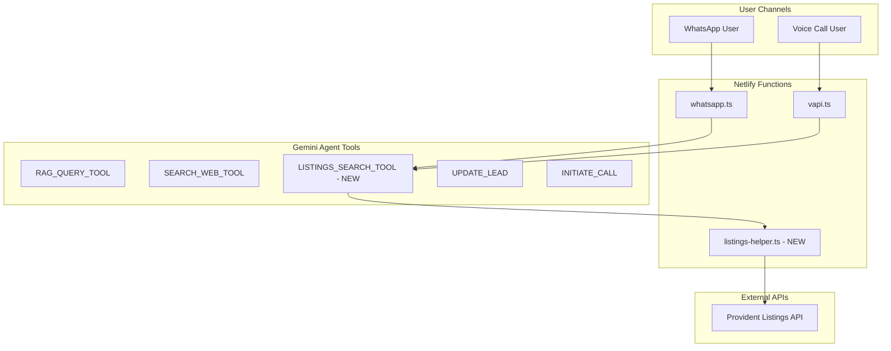

# Live Property Listings Integration Plan

## Overview

This plan integrates real-time property listings from Provident Real Estate into the WhatsApp and Voice agents, enabling them to provide investors with up-to-date property information during conversations.

## Architecture



## Implementation Steps

### Step 1: Create Listings Helper Module

Create a new file `netlify/functions/listings-helper.ts` that handles all Provident API communication:

```typescript
// netlify/functions/listings-helper.ts

export interface ListingSearchParams {
    location?: string;
    property_type?: string;
    min_price?: number;
    max_price?: number;
    bedrooms?: number;
    bathrooms?: number;
    min_size?: number;
    max_size?: number;
    status?: string;
    limit?: number;
}

export interface PropertyListing {
    id: string;
    title: string;
    property_type: string;
    location: string;
    area: string;
    price: number;
    bedrooms: number;
    bathrooms: number;
    size_sqft: number;
    status: string;
    description?: string;
    image_url?: string;
    listing_url?: string;
}

// Configuration - Update these when you have the actual API details
const LISTINGS_CONFIG = {
    baseUrl: process.env.PROVIDENT_API_URL || 'https://api.provident.ae/v1',
    apiKey: process.env.PROVIDENT_API_KEY || '',
    authHeader: process.env.PROVIDENT_AUTH_HEADER || 'X-API-Key', // Could be 'Authorization', 'X-API-Key', etc.
    authPrefix: process.env.PROVIDENT_AUTH_PREFIX || '', // Could be 'Bearer ', 'Basic ', or empty
};

// Transform API response to standard format
// UPDATE THIS FUNCTION when you know the actual API response structure
function transformApiResponse(apiData: any): PropertyListing[] {
    // Example transformation - adjust based on actual API response
    const listings = Array.isArray(apiData) ? apiData : apiData.listings || apiData.properties || apiData.data || [];
    
    return listings.map((item: any) => ({
        id: item.id || item.reference || item.listing_id,
        title: item.title || item.name || `${item.bedrooms} BR ${item.property_type} in ${item.location}`,
        property_type: item.property_type || item.type || item.category,
        location: item.location || item.community || item.area,
        area: item.area || item.sub_community || item.district,
        price: parseFloat(item.price || item.asking_price || item.sale_price || 0),
        bedrooms: parseInt(item.bedrooms || item.beds || item.br || 0),
        bathrooms: parseInt(item.bathrooms || item.baths || 0),
        size_sqft: parseFloat(item.size || item.size_sqft || item.area_sqft || item.built_up_area || 0),
        status: item.status || item.availability || 'Available',
        description: item.description || item.details,
        image_url: item.image_url || item.photo || item.main_image,
        listing_url: item.url || item.listing_url || item.link,
    }));
}

// Build query parameters based on API structure
// UPDATE THIS FUNCTION when you know the actual API parameter names
function buildQueryParams(params: ListingSearchParams): Record<string, string> {
    const queryParams: Record<string, string> = {};
    
    // Map our standard params to API-specific params
    // Adjust these mappings based on actual API documentation
    if (params.location) queryParams['location'] = params.location;
    if (params.property_type) queryParams['property_type'] = params.property_type;
    if (params.min_price) queryParams['min_price'] = params.min_price.toString();
    if (params.max_price) queryParams['max_price'] = params.max_price.toString();
    if (params.bedrooms) queryParams['bedrooms'] = params.bedrooms.toString();
    if (params.bathrooms) queryParams['bathrooms'] = params.bathrooms.toString();
    if (params.min_size) queryParams['min_size'] = params.min_size.toString();
    if (params.max_size) queryParams['max_size'] = params.max_size.toString();
    if (params.status) queryParams['status'] = params.status;
    queryParams['limit'] = (params.limit || 5).toString();
    
    return queryParams;
}

export async function searchListings(params: ListingSearchParams): Promise<string> {
    if (!LISTINGS_CONFIG.apiKey) {
        console.error('[Listings] API key not configured');
        return 'Property listings API is not configured. Please contact support.';
    }

    try {
        console.log('[Listings] Searching with params:', JSON.stringify(params));
        
        const queryParams = buildQueryParams(params);
        const queryString = new URLSearchParams(queryParams).toString();
        const url = `${LISTINGS_CONFIG.baseUrl}/listings?${queryString}`;
        
        console.log('[Listings] Fetching:', url);
        
        const headers: Record<string, string> = {
            'Content-Type': 'application/json',
            'Accept': 'application/json',
        };
        
        // Add authentication header
        headers[LISTINGS_CONFIG.authHeader] = `${LISTINGS_CONFIG.authPrefix}${LISTINGS_CONFIG.apiKey}`;
        
        const response = await fetch(url, {
            method: 'GET',
            headers,
        });

        if (!response.ok) {
            console.error('[Listings] API error:', response.status, await response.text());
            return 'Unable to fetch listings at the moment. Please try again later.';
        }

        const data = await response.json();
        const listings = transformApiResponse(data);
        
        console.log('[Listings] Found', listings.length, 'properties');

        if (listings.length === 0) {
            return 'No properties found matching your criteria. Would you like to adjust your search?';
        }

        // Format listings for conversation
        const formattedListings = listings.slice(0, params.limit || 5).map((listing, index) => {
            const priceFormatted = listing.price >= 1000000 
                ? `${(listing.price / 1000000).toFixed(1)}M AED`
                : `${(listing.price / 1000).toFixed(0)}K AED`;
            
            return `${index + 1}. **${listing.title}**
   - Location: ${listing.location}${listing.area ? `, ${listing.area}` : ''}
   - Price: ${priceFormatted}
   - Beds/Baths: ${listing.bedrooms} BR / ${listing.bathrooms} BA
   - Size: ${listing.size_sqft.toLocaleString()} sqft
   - Status: ${listing.status}`;
        }).join('\n\n');

        return `Found ${listings.length} matching properties:\n\n${formattedListings}`;

    } catch (error: any) {
        console.error('[Listings] Exception:', error.message);
        return 'Error searching listings. Please try again.';
    }
}

// Get a specific listing by ID
export async function getListingDetails(listingId: string): Promise<string> {
    if (!LISTINGS_CONFIG.apiKey) {
        return 'Property listings API is not configured.';
    }

    try {
        const headers: Record<string, string> = {
            'Content-Type': 'application/json',
            'Accept': 'application/json',
        };
        headers[LISTINGS_CONFIG.authHeader] = `${LISTINGS_CONFIG.authPrefix}${LISTINGS_CONFIG.apiKey}`;

        const response = await fetch(`${LISTINGS_CONFIG.baseUrl}/listings/${listingId}`, {
            method: 'GET',
            headers,
        });

        if (!response.ok) {
            return 'Unable to fetch listing details.';
        }

        const data = await response.json();
        const listing = transformApiResponse([data])[0];

        if (!listing) {
            return 'Listing not found.';
        }

        const priceFormatted = listing.price >= 1000000 
            ? `${(listing.price / 1000000).toFixed(1)}M AED`
            : `${(listing.price / 1000).toFixed(0)}K AED`;

        return `**${listing.title}**
- Location: ${listing.location}${listing.area ? `, ${listing.area}` : ''}
- Price: ${priceFormatted}
- Bedrooms: ${listing.bedrooms}
- Bathrooms: ${listing.bathrooms}
- Size: ${listing.size_sqft.toLocaleString()} sqft
- Status: ${listing.status}
${listing.description ? `\nDescription: ${listing.description}` : ''}
${listing.listing_url ? `\nView listing: ${listing.listing_url}` : ''}`;

    } catch (error: any) {
        console.error('[Listings] Exception:', error.message);
        return 'Error fetching listing details.';
    }
}
```

### Step 2: Update WhatsApp Agent (whatsapp.ts)

Add the new tool to the WhatsApp agent:

#### 2a. Add Import

At the top of `netlify/functions/whatsapp.ts`, add:

```typescript
import { searchListings, getListingDetails } from './listings-helper';
```

#### 2b. Add Tool Declaration

In the `tools` array (around line 332), add the new tool:

```typescript
{
    name: "LISTINGS_SEARCH_TOOL",
    description: "Search Provident Real Estate's live property listings. Use when the user asks about available properties, specific units, or wants property recommendations based on their criteria like budget, location, or bedroom count.",
    parameters: {
        type: "OBJECT",
        properties: {
            location: { 
                type: "STRING", 
                description: "Area or community - e.g., Downtown Dubai, Dubai Marina, Palm Jumeirah, Business Bay, JBR" 
            },
            property_type: { 
                type: "STRING", 
                description: "Property type - apartment, villa, townhouse, penthouse, studio" 
            },
            min_price: { 
                type: "NUMBER", 
                description: "Minimum price in AED" 
            },
            max_price: { 
                type: "NUMBER", 
                description: "Maximum price in AED" 
            },
            bedrooms: { 
                type: "NUMBER", 
                description: "Number of bedrooms (0 for studio)" 
            },
            limit: { 
                type: "NUMBER", 
                description: "Maximum number of results to return, default 3" 
            }
        }
    }
},
{
    name: "GET_LISTING_DETAILS",
    description: "Get detailed information about a specific property listing by its ID.",
    parameters: {
        type: "OBJECT",
        properties: {
            listing_id: { 
                type: "STRING", 
                description: "The property listing ID" 
            }
        },
        required: ["listing_id"]
    }
}
```

#### 2c. Add Tool Handler

In the function call handling loop (around line 430), add:

```typescript
else if (name === 'LISTINGS_SEARCH_TOOL') {
    console.log('[Listings] Search called with:', JSON.stringify(args));
    toolResult = await searchListings({
        location: (args as any).location,
        property_type: (args as any).property_type,
        min_price: (args as any).min_price,
        max_price: (args as any).max_price,
        bedrooms: (args as any).bedrooms,
        limit: (args as any).limit || 3
    });
} else if (name === 'GET_LISTING_DETAILS') {
    console.log('[Listings] Details called for:', (args as any).listing_id);
    toolResult = await getListingDetails((args as any).listing_id);
}
```

#### 2d. Update System Instruction

Update the `systemInstruction` (around line 306) to include listings guidance:

```typescript
const systemInstruction = `You are the AI Assistant for Provident Real Estate, a premier Dubai real estate agency using the AURO platform. Your primary sources of information are:
1. LISTINGS_SEARCH_TOOL - For live, available properties (ALWAYS use this first for property searches)
2. RAG Knowledge Base - For company info, payment plans, developer details
3. SEARCH_WEB_TOOL - For market trends, news, and general info

YOUR GOAL:
Qualify the lead by naturally asking for missing details, then help them find matching properties.
${leadContext}

REQUIRED DETAILS (Ask only if "Unknown" above):
1. Name
2. Email Address
3. Budget
4. Property Type
5. Preferred Location
6. Timeline

PROPERTY SEARCH RULES:
- WHEN the user mentions interest in a property, location, or budget, USE 'LISTINGS_SEARCH_TOOL' to show real available listings.
- PRESENT 2-3 matching properties with key details (location, price, beds, size).
- AFTER showing listings, ask: "Would you like more details on any of these, or shall I search with different criteria?"
- If the lead has provided budget and location, proactively search for matching properties.

GENERAL RULES:
- IF the user provides any of the required details, YOU MUST CALL the 'UPDATE_LEAD' tool immediately.
- IF all "Required Details" are known, PROPOSE: "Would you like to schedule a call with one of our specialists to discuss specific units?"
- IF the user agrees to a call, YOU MUST CALL the 'INITIATE_CALL' tool immediately.
- USE 'SEARCH_WEB_TOOL' for market data, competitor info, or general questions not in your knowledge base.
- NEVER invent property listings or prices - always use the LISTINGS_SEARCH_TOOL.
- Keep responses under 80 words when showing listings.`;
```

### Step 3: Update Voice Agent (vapi.ts)

Add similar functionality to the voice agent:

#### 3a. Add Import

```typescript
import { searchListings, getListingDetails } from './listings-helper';
```

#### 3b. Add Tool Handler

In the tool handling section (around line 126), add:

```typescript
// LISTINGS_SEARCH_TOOL
if (name === 'LISTINGS_SEARCH_TOOL') {
    console.log('[VAPI] Listings search:', JSON.stringify(args));
    try {
        const result = await searchListings({
            location: args.location,
            property_type: args.property_type,
            min_price: args.min_price,
            max_price: args.max_price,
            bedrooms: args.bedrooms,
            limit: args.limit || 3
        });
        return { toolCallId: call.id, result };
    } catch (err: any) {
        console.error('[VAPI] Listings error:', err.message);
        return { toolCallId: call.id, result: 'Error searching listings.' };
    }
}

// GET_LISTING_DETAILS
if (name === 'GET_LISTING_DETAILS') {
    console.log('[VAPI] Listing details:', args.listing_id);
    try {
        const result = await getListingDetails(args.listing_id);
        return { toolCallId: call.id, result };
    } catch (err: any) {
        console.error('[VAPI] Listing details error:', err.message);
        return { toolCallId: call.id, result: 'Error fetching listing details.' };
    }
}
```

#### 3c. Update VAPI Assistant Configuration

You'll also need to update your VAPI assistant configuration to include the new tools. In your VAPI dashboard or assistant config, add:

```json
{
    "name": "LISTINGS_SEARCH_TOOL",
    "description": "Search available property listings by criteria",
    "parameters": {
        "type": "object",
        "properties": {
            "location": { "type": "string" },
            "property_type": { "type": "string" },
            "min_price": { "type": "number" },
            "max_price": { "type": "number" },
            "bedrooms": { "type": "number" },
            "limit": { "type": "number" }
        }
    }
}
```

### Step 4: Environment Variables

Add these environment variables to your Netlify site:

| Variable | Description | Example |
|----------|-------------|---------|
| `PROVIDENT_API_URL` | Base URL for the listings API | `https://api.provident.ae/v1` |
| `PROVIDENT_API_KEY` | API key or token | `your-api-key-here` |
| `PROVIDENT_AUTH_HEADER` | Authentication header name | `X-API-Key` or `Authorization` |
| `PROVIDENT_AUTH_PREFIX` | Prefix for auth value | `` or `Bearer ` |

### Step 5: Configuration Checklist

When you receive the Provident API documentation, update these areas:

1. **`listings-helper.ts` - `transformApiResponse` function**
   - Map API response fields to the standard `PropertyListing` interface
   - Handle nested data structures if needed

2. **`listings-helper.ts` - `buildQueryParams` function**
   - Map search parameters to API-specific query parameter names
   - Handle any special filtering syntax

3. **`listings-helper.ts` - `LISTINGS_CONFIG`**
   - Set the correct base URL
   - Configure authentication method

4. **Environment Variables**
   - Add all required credentials to Netlify

## Example Conversation Flow

After implementation, conversations will flow like this:

```
User: "I'm looking for a 2-bedroom apartment in Dubai Marina, budget around 2M AED"

Agent: [Uses UPDATE_LEAD to save: location=Dubai Marina, budget=2M AED, bedrooms=2]
       [Uses LISTINGS_SEARCH_TOOL with: location=Dubai Marina, bedrooms=2, max_price=2000000]

Agent: "I found 3 matching properties in Dubai Marina:

1. **2 BR Apartment in Marina Gate**
   - Price: 1.8M AED
   - Size: 1,250 sqft
   - Status: Available

2. **2 BR in Jumeirah Living**
   - Price: 1.95M AED
   - Size: 1,400 sqft
   - Status: Available

Would you like more details on any of these, or should I schedule a viewing?"
```

## Testing Plan

1. **Unit Test** - Test `searchListings` function with mock API responses
2. **Integration Test** - Send test WhatsApp messages asking for properties
3. **Voice Test** - Test VAPI calls with property search requests
4. **Edge Cases**:
   - No results found
   - API timeout/error
   - Missing search criteria
   - Invalid location names

## Rollback Plan

If issues arise:
1. Comment out the `LISTINGS_SEARCH_TOOL` from the tools array
2. Remove the tool handler from the function call loop
3. Agents will fall back to RAG + Web Search only

## Files to Create/Modify

| File | Action | Description |
|------|--------|-------------|
| `netlify/functions/listings-helper.ts` | CREATE | New module for listings API |
| `netlify/functions/whatsapp.ts` | MODIFY | Add tools and handlers |
| `netlify/functions/vapi.ts` | MODIFY | Add tool handlers |
| `.env` / Netlify Config | MODIFY | Add API credentials |

## Next Steps

1. [ ] Obtain Provident API documentation
2. [ ] Update `transformApiResponse` for actual API format
3. [ ] Update `buildQueryParams` for actual API parameters
4. [ ] Set environment variables in Netlify
5. [ ] Deploy and test with sample searches
6. [ ] Monitor logs for any API errors
