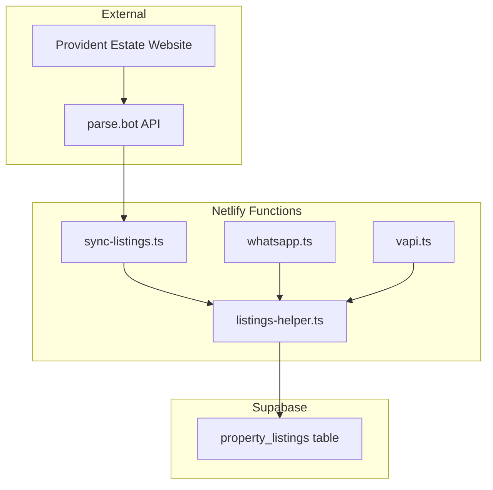

# Parse.bot Property Listings Integration Plan

## Overview

Integrate parse.bot API to fetch the latest 10 property listings from Provident Estate and make them available to WhatsApp and Voice agents for real-time property discussions.

## Architecture



---

## 1. Database Schema

### New Table: `property_listings`

```sql
CREATE TABLE public.property_listings (
  id UUID DEFAULT gen_random_uuid() PRIMARY KEY,
  property_id TEXT UNIQUE NOT NULL,
  property_title TEXT NOT NULL,
  property_url TEXT NOT NULL,
  property_type TEXT,
  transaction_type TEXT DEFAULT 'sale',
  community TEXT,
  project_name TEXT,
  bedrooms INTEGER,
  bathrooms INTEGER,
  built_up_area_sqft NUMERIC,
  plot_area_sqft NUMERIC,
  price_aed NUMERIC,
  price_currency TEXT DEFAULT 'AED',
  payment_plan_available TEXT,
  handover_status TEXT,
  developer_name TEXT,
  furnishing_status TEXT,
  key_features JSONB DEFAULT '[]'::jsonb,
  agent_name TEXT,
  agent_phone TEXT,
  image_urls JSONB DEFAULT '[]'::jsonb,
  breadcrumb_location TEXT,
  raw_data JSONB,
  created_at TIMESTAMPTZ DEFAULT NOW(),
  updated_at TIMESTAMPTZ DEFAULT NOW(),
  synced_at TIMESTAMPTZ DEFAULT NOW()
);

CREATE INDEX idx_listings_property_type ON property_listings(property_type);
CREATE INDEX idx_listings_community ON property_listings(community);
CREATE INDEX idx_listings_price ON property_listings(price_aed);
CREATE INDEX idx_listings_bedrooms ON property_listings(bedrooms);
CREATE INDEX idx_listings_synced ON property_listings(synced_at DESC);
```

---

## 2. New Files to Create

### 2.1 `netlify/functions/listings-helper.ts`

Shared module for parse.bot API integration:

```typescript
// Core functionality:
// - fetchFromParseBot(): Call aggregate_properties endpoint
// - upsertListings(): Insert/update listings in Supabase
// - searchListings(): Query listings by criteria
// - getLatestListings(): Get most recent 10 listings
// - formatListingForAgent(): Format listing for AI context
```

**Key Functions:**

| Function | Purpose |
|----------|---------|
| `fetchFromParseBot()` | Call parse.bot aggregate_properties API |
| `upsertListings(listings)` | Upsert listings into Supabase |
| `searchListings(filters)` | Search by bedrooms, price, community, type |
| `getLatestListings(limit)` | Get N most recent listings |
| `formatListingForAgent(listing)` | Format for AI system prompt |
| `formatListingForWhatsApp(listing)` | Format for WhatsApp message with image |

### 2.2 `netlify/functions/sync-listings.ts`

Scheduled function to sync listings periodically:

```typescript
// Triggered manually or via scheduled job
// 1. Fetch latest 10 listings from parse.bot
// 2. Upsert into property_listings table
// 3. Log sync status
```

---

## 3. Agent Tool: SEARCH_LISTINGS

### Tool Definition

```typescript
{
  name: "SEARCH_LISTINGS",
  description: "Search available property listings from Provident Estate based on criteria",
  parameters: {
    type: "OBJECT",
    properties: {
      property_type: { 
        type: "STRING", 
        description: "Type: apartment, villa, townhouse, penthouse" 
      },
      min_bedrooms: { type: "NUMBER" },
      max_bedrooms: { type: "NUMBER" },
      min_price: { type: "NUMBER", description: "Minimum price in AED" },
      max_price: { type: "NUMBER", description: "Maximum price in AED" },
      community: { type: "STRING", description: "Location/community name" },
      limit: { type: "NUMBER", description: "Max results (default 3)" }
    }
  }
}
```

### Tool Handler

```typescript
if (name === 'SEARCH_LISTINGS') {
  const listings = await searchListings({
    property_type: args.property_type,
    min_bedrooms: args.min_bedrooms,
    max_bedrooms: args.max_bedrooms,
    min_price: args.min_price,
    max_price: args.max_price,
    community: args.community,
    limit: args.limit || 3
  });
  
  if (listings.length === 0) {
    return { toolCallId: call.id, result: "No matching listings found." };
  }
  
  const formatted = listings.map(formatListingForAgent).join('\n\n');
  return { toolCallId: call.id, result: formatted };
}
```

---

## 4. System Prompt Updates

### WhatsApp Agent (whatsapp.ts)

Add to system instruction:

```
PROPERTY LISTINGS:
You have access to the latest property listings from Provident Estate via the SEARCH_LISTINGS tool.
- When the lead mentions budget, location, or property preferences, PROACTIVELY search and suggest relevant listings
- When sharing a listing, include the property URL and first image URL
- Format: "I found a [bedrooms]-bedroom [type] in [community] for AED [price]. [brief features]. Here's the listing: [url]"
- If multiple matches, present top 2-3 options briefly
```

### Voice Agent (vapi.ts)

Add to system instruction:

```
PROPERTY LISTINGS:
You have access to live property listings via the SEARCH_LISTINGS tool.
- Proactively suggest listings when lead preferences are known
- Keep verbal descriptions concise (property type, location, price, key feature)
- Offer to send details via WhatsApp: "I can send you the full details and photos on WhatsApp"
```

---

## 5. WhatsApp Image Support

### Current TwiML Response

```xml
<Response>
  <Message>
    <Body>Text response</Body>
  </Message>
</Response>
```

### Enhanced with Images

```xml
<Response>
  <Message>
    <Body>I found a 2-bedroom apartment in Dubai Marina...</Body>
    <Media>https://example.com/property-image.jpg</Media>
  </Message>
</Response>
```

### Implementation

Add logic to detect when response contains property listing and extract image URL:

```typescript
// After AI generates response
let imageUrl = null;
if (responseText.includes('[IMAGE:')) {
  const match = responseText.match(/\[IMAGE:(https?:\/\/[^\]]+)\]/);
  if (match) {
    imageUrl = match[1];
    responseText = responseText.replace(/\[IMAGE:[^\]]+\]/, '');
  }
}

// In TwiML generation
if (imageUrl) {
  twiml += `<Media>${imageUrl}</Media>`;
}
```

---

## 6. Environment Variables

Add to `.env.example` and Netlify:

```
PARSEBOT_API_KEY=your_parsebot_api_key
PARSEBOT_SCRAPER_ID=98f4861a-6e6b-41ed-8efe-f9ff96ee8fe8
```

---

## 7. Implementation Order

| Step | Task | File(s) |
|------|------|---------|
| 1 | Create SQL migration for property_listings table | `property_listings.sql` |
| 2 | Create listings-helper.ts module | `netlify/functions/listings-helper.ts` |
| 3 | Create sync-listings.ts function | `netlify/functions/sync-listings.ts` |
| 4 | Add SEARCH_LISTINGS tool to whatsapp.ts | `netlify/functions/whatsapp.ts` |
| 5 | Add SEARCH_LISTINGS tool to vapi.ts | `netlify/functions/vapi.ts` |
| 6 | Update system prompts in both agents | Both files |
| 7 | Add image support to WhatsApp responses | `netlify/functions/whatsapp.ts` |
| 8 | Update .env.example | `.env.example` |
| 9 | Test sync function manually | Manual trigger |
| 10 | Test agent conversations | End-to-end testing |

---

## 8. Parse.bot API Integration

### Endpoint

```
POST https://api.parse.bot/scraper/98f4861a-6e6b-41ed-8efe-f9ff96ee8fe8/aggregate_properties
```

### Request Headers

```
Authorization: Bearer ${PARSEBOT_API_KEY}
Content-Type: application/json
```

### Expected Response Format

```json
[
  {
    "property_title": "Luxury 3BR Apartment in Dubai Marina",
    "property_url": "https://providentestate.com/...",
    "property_type": "apartment",
    "transaction_type": "sale",
    "community": "Dubai Marina",
    "project_name": "Marina Gate",
    "number_of_bedrooms": 3,
    "number_of_bathrooms": 4,
    "built_up_area_sqft": 2500,
    "plot_area_sqft": null,
    "price_aed": 4500000,
    "price_currency": "AED",
    "payment_plan_available": "yes",
    "handover_status": "ready",
    "developer_name": "Select Group",
    "furnishing_status": "unfurnished",
    "key_features": ["Sea View", "High Floor", "Maid Room"],
    "agent_name": "John Smith",
    "agent_phone": "+971501234567",
    "image_urls": ["https://...", "https://..."],
    "breadcrumb_location_hierarchy": "Dubai > Dubai Marina > Marina Gate"
  }
]
```

---

## 9. Error Handling

| Scenario | Handling |
|----------|----------|
| parse.bot API down | Return cached listings from Supabase |
| No matching listings | Agent says "No exact matches, but here are similar options..." |
| Empty database | Agent acknowledges and offers to take requirements for follow-up |
| Invalid API key | Log error, continue with existing cached data |

---

## 10. Future Enhancements

1. **Vector embeddings for listings** - Enable semantic search across listing descriptions
2. **Lead-listing matching** - Auto-match leads to listings based on preferences
3. **Listing alerts** - Notify leads when new matching properties are added
4. **Webhook from parse.bot** - Real-time sync when new listings are scraped
5. **Multi-source aggregation** - Add more property sources beyond Provident

---

## Summary

This integration enables:

1. **Fresh property data** - Latest 10 listings from Provident Estate via parse.bot
2. **Persistent cache** - Listings stored in Supabase for reliability
3. **Smart agent tools** - Both WhatsApp and Voice agents can search/suggest properties
4. **Rich media** - Property images shared via WhatsApp
5. **Proactive recommendations** - Agents suggest listings based on lead preferences
