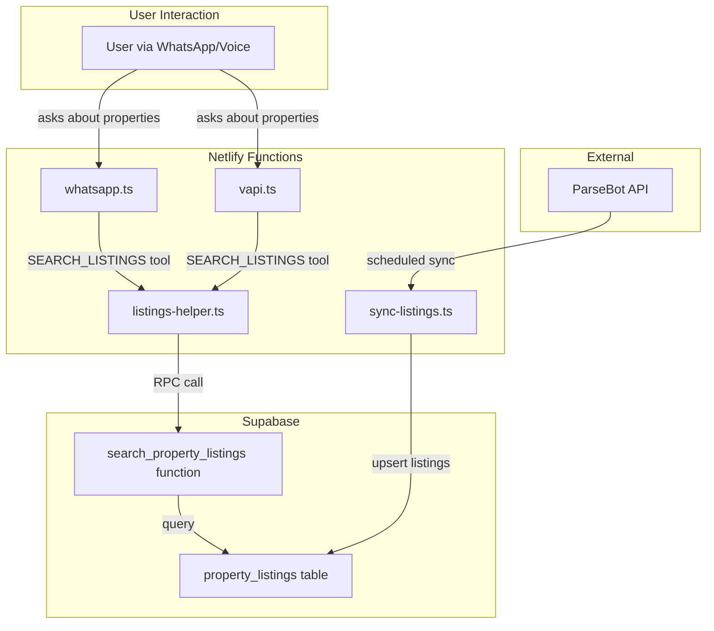

# Property Listings Integration Plan

## Executive Summary

This plan addresses the critical error where the AI agent cannot provide property listings to users because the required database infrastructure and search functionality are missing.

### Problem Statement
From the error logs:
```
ERROR [Listings] Search error: Could not find the function public.search_property_listings
ERROR [Listings] Direct search error: Could not find the table 'public.property_listings'
```

The deployed application has a `SEARCH_LISTINGS` tool that attempts to:
1. Call a Supabase RPC function `search_property_listings` - does not exist
2. Fall back to querying a `property_listings` table - does not exist

### Solution Overview
Implement end-to-end property listings functionality:
1. Database schema for storing listings
2. Search function for filtering listings
3. ParseBot API integration for syncing live data
4. SEARCH_LISTINGS tool in WhatsApp and VAPI handlers

---

## Architecture Diagram



---

## Component 1: Database Schema

### File: `property_listings.sql`

```sql
-- Property Listings Table for AURO Real Estate Platform
-- Run this in Supabase SQL Editor

-- 1. Create the property_listings table
CREATE TABLE IF NOT EXISTS public.property_listings (
    id UUID DEFAULT gen_random_uuid() PRIMARY KEY,
    external_id TEXT UNIQUE,                    -- ParseBot listing ID for deduplication
    
    -- Core Property Info
    title TEXT NOT NULL,
    description TEXT,
    property_type TEXT NOT NULL,                -- apartment, villa, townhouse, penthouse, etc.
    offering_type TEXT DEFAULT 'sale',          -- sale, rent
    
    -- Location
    community TEXT,                             -- Dubai Marina, Downtown, JBR, etc.
    sub_community TEXT,                         -- Building or sub-area name
    address TEXT,
    latitude DECIMAL(10, 8),
    longitude DECIMAL(11, 8),
    
    -- Specifications
    bedrooms INTEGER,
    bathrooms INTEGER,
    area_sqft DECIMAL(12, 2),
    floor_number INTEGER,
    
    -- Pricing
    price DECIMAL(15, 2),
    price_per_sqft DECIMAL(10, 2),
    currency TEXT DEFAULT 'AED',
    
    -- Media
    images JSONB DEFAULT '[]'::jsonb,           -- Array of image URLs
    virtual_tour_url TEXT,
    
    -- Agent/Source Info
    agent_name TEXT,
    agent_phone TEXT,
    agent_company TEXT,
    source TEXT DEFAULT 'parsebot',             -- Data source identifier
    source_url TEXT,                            -- Original listing URL
    
    -- Status and Metadata
    status TEXT DEFAULT 'active',               -- active, sold, rented, inactive
    featured BOOLEAN DEFAULT FALSE,
    
    -- Amenities and Features
    amenities JSONB DEFAULT '[]'::jsonb,        -- pool, gym, parking, etc.
    features JSONB DEFAULT '{}'::jsonb,         -- Additional features as key-value
    
    -- Timestamps
    created_at TIMESTAMPTZ DEFAULT NOW(),
    updated_at TIMESTAMPTZ DEFAULT NOW(),
    synced_at TIMESTAMPTZ DEFAULT NOW()         -- Last sync from external source
);

-- 2. Create indexes for search performance
CREATE INDEX IF NOT EXISTS idx_listings_community ON public.property_listings(community);
CREATE INDEX IF NOT EXISTS idx_listings_property_type ON public.property_listings(property_type);
CREATE INDEX IF NOT EXISTS idx_listings_price ON public.property_listings(price);
CREATE INDEX IF NOT EXISTS idx_listings_bedrooms ON public.property_listings(bedrooms);
CREATE INDEX IF NOT EXISTS idx_listings_status ON public.property_listings(status);
CREATE INDEX IF NOT EXISTS idx_listings_offering ON public.property_listings(offering_type);
CREATE INDEX IF NOT EXISTS idx_listings_external ON public.property_listings(external_id);

-- Composite index for common search patterns
CREATE INDEX IF NOT EXISTS idx_listings_search ON public.property_listings(
    status, offering_type, property_type, community, price, bedrooms
);

-- 3. Enable RLS
ALTER TABLE public.property_listings ENABLE ROW LEVEL SECURITY;

-- 4. Create policies
DROP POLICY IF EXISTS "Enable read access for all users" ON public.property_listings;
DROP POLICY IF EXISTS "Enable write access for service role" ON public.property_listings;

CREATE POLICY "Enable read access for all users" 
    ON public.property_listings FOR SELECT USING (true);

CREATE POLICY "Enable write access for service role" 
    ON public.property_listings FOR ALL 
    USING (auth.role() = 'service_role');

-- 5. Add to realtime publication
ALTER PUBLICATION supabase_realtime ADD TABLE public.property_listings;

-- 6. Create updated_at trigger
CREATE OR REPLACE FUNCTION update_updated_at_column()
RETURNS TRIGGER AS $$
BEGIN
    NEW.updated_at = NOW();
    RETURN NEW;
END;
$$ language 'plpgsql';

DROP TRIGGER IF EXISTS update_property_listings_updated_at ON public.property_listings;
CREATE TRIGGER update_property_listings_updated_at
    BEFORE UPDATE ON public.property_listings
    FOR EACH ROW
    EXECUTE FUNCTION update_updated_at_column();
```

---

## Component 2: Search Function

### File: `search_property_listings.sql`

```sql
-- Search Property Listings Function
-- Flexible search with multiple filter parameters

CREATE OR REPLACE FUNCTION search_property_listings(
    p_property_type TEXT DEFAULT NULL,
    p_min_bedrooms INTEGER DEFAULT NULL,
    p_max_bedrooms INTEGER DEFAULT NULL,
    p_min_price DECIMAL DEFAULT NULL,
    p_max_price DECIMAL DEFAULT NULL,
    p_community TEXT DEFAULT NULL,
    p_offering_type TEXT DEFAULT 'sale',
    p_limit INTEGER DEFAULT 5
)
RETURNS TABLE (
    id UUID,
    title TEXT,
    property_type TEXT,
    community TEXT,
    sub_community TEXT,
    bedrooms INTEGER,
    bathrooms INTEGER,
    area_sqft DECIMAL,
    price DECIMAL,
    price_per_sqft DECIMAL,
    images JSONB,
    agent_name TEXT,
    agent_phone TEXT,
    source_url TEXT
)
LANGUAGE plpgsql
STABLE
AS $$
BEGIN
    RETURN QUERY
    SELECT
        pl.id,
        pl.title,
        pl.property_type,
        pl.community,
        pl.sub_community,
        pl.bedrooms,
        pl.bathrooms,
        pl.area_sqft,
        pl.price,
        pl.price_per_sqft,
        pl.images,
        pl.agent_name,
        pl.agent_phone,
        pl.source_url
    FROM public.property_listings pl
    WHERE pl.status = 'active'
        AND (p_offering_type IS NULL OR pl.offering_type = LOWER(p_offering_type))
        AND (p_property_type IS NULL OR LOWER(pl.property_type) = LOWER(p_property_type))
        AND (p_min_bedrooms IS NULL OR pl.bedrooms >= p_min_bedrooms)
        AND (p_max_bedrooms IS NULL OR pl.bedrooms <= p_max_bedrooms)
        AND (p_min_price IS NULL OR pl.price >= p_min_price)
        AND (p_max_price IS NULL OR pl.price <= p_max_price)
        AND (p_community IS NULL OR LOWER(pl.community) LIKE '%' || LOWER(p_community) || '%')
    ORDER BY pl.featured DESC, pl.updated_at DESC
    LIMIT p_limit;
END;
$$;

-- Grant execute permission
GRANT EXECUTE ON FUNCTION search_property_listings TO anon, authenticated, service_role;
```

---

## Component 3: Listings Helper Module

### File: `netlify/functions/listings-helper.ts`

This shared module handles the search logic for both WhatsApp and VAPI handlers.

```typescript
import { createClient } from "@supabase/supabase-js";

const supabaseUrl = process.env.VITE_SUPABASE_URL || process.env.SUPABASE_URL || "";
const supabaseKey = process.env.SUPABASE_SERVICE_ROLE_KEY || process.env.VITE_SUPABASE_ANON_KEY || "";
const supabase = createClient(supabaseUrl, supabaseKey);

export interface SearchFilters {
    property_type?: string;
    min_bedrooms?: number;
    max_bedrooms?: number;
    min_price?: number;
    max_price?: number;
    community?: string;
    offering_type?: string;
    limit?: number;
}

export interface PropertyListing {
    id: string;
    title: string;
    property_type: string;
    community: string;
    sub_community: string;
    bedrooms: number;
    bathrooms: number;
    area_sqft: number;
    price: number;
    price_per_sqft: number;
    images: string[];
    agent_name: string;
    agent_phone: string;
    source_url: string;
}

export async function searchListings(filters: SearchFilters): Promise<PropertyListing[]> {
    console.log('[Listings] Searching with filters:', JSON.stringify(filters, null, 2));
    
    try {
        // Try RPC function first
        const { data, error } = await supabase.rpc('search_property_listings', {
            p_property_type: filters.property_type || null,
            p_min_bedrooms: filters.min_bedrooms || null,
            p_max_bedrooms: filters.max_bedrooms || null,
            p_min_price: filters.min_price || null,
            p_max_price: filters.max_price || null,
            p_community: filters.community || null,
            p_offering_type: filters.offering_type || 'sale',
            p_limit: filters.limit || 3
        });

        if (error) {
            console.error('[Listings] RPC search error:', error);
            // Fall back to direct query
            return await directSearch(filters);
        }

        console.log(`[Listings] Found ${data?.length || 0} results via RPC`);
        return data || [];
        
    } catch (e: any) {
        console.error('[Listings] Search exception:', e.message);
        return [];
    }
}

async function directSearch(filters: SearchFilters): Promise<PropertyListing[]> {
    console.log('[Listings] Falling back to direct query');
    
    let query = supabase
        .from('property_listings')
        .select('id, title, property_type, community, sub_community, bedrooms, bathrooms, area_sqft, price, price_per_sqft, images, agent_name, agent_phone, source_url')
        .eq('status', 'active');

    if (filters.property_type) {
        query = query.ilike('property_type', filters.property_type);
    }
    if (filters.community) {
        query = query.ilike('community', `%${filters.community}%`);
    }
    if (filters.min_bedrooms) {
        query = query.gte('bedrooms', filters.min_bedrooms);
    }
    if (filters.max_bedrooms) {
        query = query.lte('bedrooms', filters.max_bedrooms);
    }
    if (filters.min_price) {
        query = query.gte('price', filters.min_price);
    }
    if (filters.max_price) {
        query = query.lte('price', filters.max_price);
    }
    if (filters.offering_type) {
        query = query.eq('offering_type', filters.offering_type.toLowerCase());
    }

    const { data, error } = await query
        .order('featured', { ascending: false })
        .order('updated_at', { ascending: false })
        .limit(filters.limit || 3);

    if (error) {
        console.error('[Listings] Direct search error:', error);
        return [];
    }

    return data || [];
}

export function formatListingsResponse(listings: PropertyListing[]): string {
    if (!listings || listings.length === 0) {
        return "I couldn't find any properties matching your criteria. Would you like me to broaden the search or try different filters?";
    }

    let response = `I found ${listings.length} properties that match your criteria:\n\n`;

    listings.forEach((listing, index) => {
        const price = new Intl.NumberFormat('en-AE', {
            style: 'currency',
            currency: 'AED',
            maximumFractionDigits: 0
        }).format(listing.price);

        const area = listing.area_sqft 
            ? `${new Intl.NumberFormat().format(listing.area_sqft)} sqft` 
            : 'N/A';

        response += `${index + 1}. *${listing.title}*\n`;
        response += `   📍 ${listing.community}${listing.sub_community ? ` - ${listing.sub_community}` : ''}\n`;
        response += `   🏠 ${listing.bedrooms} BR | ${listing.bathrooms} BA | ${area}\n`;
        response += `   💰 ${price}\n`;
        
        if (listing.images && listing.images.length > 0) {
            response += `   🖼️ ${listing.images[0]}\n`;
        }
        response += '\n';
    });

    response += "Would you like more details on any of these properties, or should I refine the search?";
    
    return response;
}
```

---

## Component 4: WhatsApp Handler Update

### Changes to `netlify/functions/whatsapp.ts`

Add the SEARCH_LISTINGS tool to the existing tools array:

```typescript
// Add import at the top
import { searchListings, formatListingsResponse, SearchFilters } from './listings-helper';

// Add to the tools array (around line 332)
{
    name: "SEARCH_LISTINGS",
    description: "Search for property listings based on user criteria. Use this when the user asks about available properties, apartments, villas, or any real estate listings.",
    parameters: {
        type: "OBJECT",
        properties: {
            property_type: { 
                type: "STRING", 
                description: "Type of property: apartment, villa, townhouse, penthouse, studio" 
            },
            community: { 
                type: "STRING", 
                description: "Location/community name: Dubai Marina, Downtown, JBR, Palm Jumeirah, etc." 
            },
            min_price: { 
                type: "NUMBER", 
                description: "Minimum price in AED" 
            },
            max_price: { 
                type: "NUMBER", 
                description: "Maximum price in AED" 
            },
            min_bedrooms: { 
                type: "NUMBER", 
                description: "Minimum number of bedrooms" 
            },
            max_bedrooms: { 
                type: "NUMBER", 
                description: "Maximum number of bedrooms" 
            },
            offering_type: {
                type: "STRING",
                description: "sale or rent"
            }
        }
    }
}

// Add handler in the function calls loop (around line 430)
else if (name === 'SEARCH_LISTINGS') {
    console.log("SEARCH_LISTINGS called with:", JSON.stringify(args));
    
    const filters: SearchFilters = {
        property_type: (args as any).property_type,
        community: (args as any).community,
        min_price: (args as any).min_price,
        max_price: (args as any).max_price,
        min_bedrooms: (args as any).min_bedrooms,
        max_bedrooms: (args as any).max_bedrooms,
        offering_type: (args as any).offering_type || 'sale',
        limit: 3
    };
    
    const listings = await searchListings(filters);
    console.log(`SEARCH_LISTINGS found ${listings.length} results`);
    
    toolResult = formatListingsResponse(listings);
}
```

---

## Component 5: ParseBot Sync Function

### File: `netlify/functions/sync-listings.ts`

```typescript
import { Handler, schedule } from "@netlify/functions";
import { createClient } from "@supabase/supabase-js";

const supabaseUrl = process.env.VITE_SUPABASE_URL || process.env.SUPABASE_URL || "";
const supabaseKey = process.env.SUPABASE_SERVICE_ROLE_KEY || "";
const supabase = createClient(supabaseUrl, supabaseKey);

const PARSEBOT_API_URL = process.env.PARSEBOT_API_URL || "";
const PARSEBOT_API_KEY = process.env.PARSEBOT_API_KEY || "";

interface ParseBotListing {
    id: string;
    title: string;
    description?: string;
    property_type: string;
    location: string;
    sub_location?: string;
    bedrooms: number;
    bathrooms: number;
    size_sqft: number;
    price: number;
    images: string[];
    agent?: {
        name: string;
        phone: string;
        company: string;
    };
    url: string;
}

async function fetchFromParseBot(): Promise<ParseBotListing[]> {
    if (!PARSEBOT_API_URL || !PARSEBOT_API_KEY) {
        console.error('[Sync] ParseBot credentials missing');
        return [];
    }

    try {
        console.log('[Sync] Fetching listings from ParseBot...');
        
        const response = await fetch(PARSEBOT_API_URL, {
            method: 'GET',
            headers: {
                'Authorization': `Bearer ${PARSEBOT_API_KEY}`,
                'Content-Type': 'application/json'
            }
        });

        if (!response.ok) {
            console.error('[Sync] ParseBot API error:', response.status);
            return [];
        }

        const data = await response.json();
        console.log(`[Sync] Received ${data.listings?.length || 0} listings from ParseBot`);
        
        return data.listings || [];
    } catch (e: any) {
        console.error('[Sync] ParseBot fetch error:', e.message);
        return [];
    }
}

function transformListing(pbListing: ParseBotListing) {
    return {
        external_id: pbListing.id,
        title: pbListing.title,
        description: pbListing.description || null,
        property_type: pbListing.property_type?.toLowerCase() || 'apartment',
        offering_type: 'sale',
        community: pbListing.location,
        sub_community: pbListing.sub_location || null,
        bedrooms: pbListing.bedrooms || 0,
        bathrooms: pbListing.bathrooms || 0,
        area_sqft: pbListing.size_sqft || null,
        price: pbListing.price || 0,
        price_per_sqft: pbListing.size_sqft && pbListing.price 
            ? Math.round(pbListing.price / pbListing.size_sqft) 
            : null,
        images: pbListing.images || [],
        agent_name: pbListing.agent?.name || null,
        agent_phone: pbListing.agent?.phone || null,
        agent_company: pbListing.agent?.company || null,
        source: 'parsebot',
        source_url: pbListing.url || null,
        status: 'active',
        synced_at: new Date().toISOString()
    };
}

async function syncListings(): Promise<{ synced: number; errors: number }> {
    const listings = await fetchFromParseBot();
    
    if (listings.length === 0) {
        return { synced: 0, errors: 0 };
    }

    let synced = 0;
    let errors = 0;

    for (const pbListing of listings) {
        try {
            const transformed = transformListing(pbListing);
            
            const { error } = await supabase
                .from('property_listings')
                .upsert(transformed, {
                    onConflict: 'external_id',
                    ignoreDuplicates: false
                });

            if (error) {
                console.error(`[Sync] Error upserting listing ${pbListing.id}:`, error);
                errors++;
            } else {
                synced++;
            }
        } catch (e: any) {
            console.error(`[Sync] Exception processing listing:`, e.message);
            errors++;
        }
    }

    console.log(`[Sync] Complete: ${synced} synced, ${errors} errors`);
    return { synced, errors };
}

// Manual trigger endpoint
const handler: Handler = async (event) => {
    // Optional: Add authentication check
    const authHeader = event.headers.authorization;
    const expectedKey = process.env.SYNC_API_KEY;
    
    if (expectedKey && authHeader !== `Bearer ${expectedKey}`) {
        return {
            statusCode: 401,
            body: JSON.stringify({ error: 'Unauthorized' })
        };
    }

    const result = await syncListings();
    
    return {
        statusCode: 200,
        body: JSON.stringify({
            success: true,
            ...result,
            timestamp: new Date().toISOString()
        }),
        headers: { 'Content-Type': 'application/json' }
    };
};

// Scheduled function - runs every 6 hours
const scheduledHandler = schedule("0 */6 * * *", async () => {
    console.log('[Sync] Running scheduled sync...');
    await syncListings();
});

export { handler, scheduledHandler };
```

---

## Component 6: Environment Variables

### Update `.env.example`

```bash
# Existing variables
GEMINI_API_KEY=
TWILIO_ACCOUNT_SID=
TWILIO_AUTH_TOKEN=
VAPI_WEBHOOK_SECRET=

# Supabase
VITE_SUPABASE_URL=
VITE_SUPABASE_ANON_KEY=
SUPABASE_SERVICE_ROLE_KEY=

# VAPI
VAPI_API_KEY=
VAPI_PHONE_NUMBER=
VAPI_ASSISTANT_ID=

# ParseBot Integration
PARSEBOT_API_URL=https://api.parse.bot/v1/listings
PARSEBOT_API_KEY=

# Sync Security
SYNC_API_KEY=

# Optional
PERPLEXITY_API_KEY=
```

---

## Implementation Checklist

### Phase 1: Database Setup
- [ ] Run `property_listings.sql` in Supabase SQL Editor
- [ ] Run `search_property_listings.sql` function creation
- [ ] Verify table and indexes created successfully
- [ ] Test RPC function with sample query

### Phase 2: Backend Integration
- [ ] Create `listings-helper.ts` module
- [ ] Add SEARCH_LISTINGS tool to `whatsapp.ts`
- [ ] Add SEARCH_LISTINGS tool to `vapi.ts`
- [ ] Test search functionality with mock data

### Phase 3: ParseBot Sync
- [ ] Create `sync-listings.ts` function
- [ ] Configure ParseBot API credentials
- [ ] Test manual sync endpoint
- [ ] Configure scheduled sync in Netlify

### Phase 4: Testing and Validation
- [ ] Insert test listings manually
- [ ] Test WhatsApp property search flow
- [ ] Test VAPI voice property search
- [ ] Verify scheduled sync works
- [ ] Monitor error logs

---

## Risk Considerations

1. **ParseBot API Format**: The exact response format from ParseBot needs to be confirmed. The `transformListing` function may need adjustment based on actual API response.

2. **Rate Limits**: If ParseBot has rate limits, the sync function may need pagination or batching logic.

3. **Data Freshness**: With 6-hour sync intervals, listings may be slightly stale. Consider reducing interval or implementing webhook-based updates.

4. **Error Handling**: Current implementation logs errors but continues. May want to implement alerting for sync failures.

5. **Fallback Behavior**: If no listings match, the agent should gracefully suggest broadening search criteria or offer to connect with a human agent.

---

## Next Steps

After reviewing this plan:
1. Confirm ParseBot API response format
2. Switch to Code mode to implement the changes
3. Deploy database schema first
4. Deploy backend code changes
5. Run initial sync to populate listings
6. Test end-to-end flow
